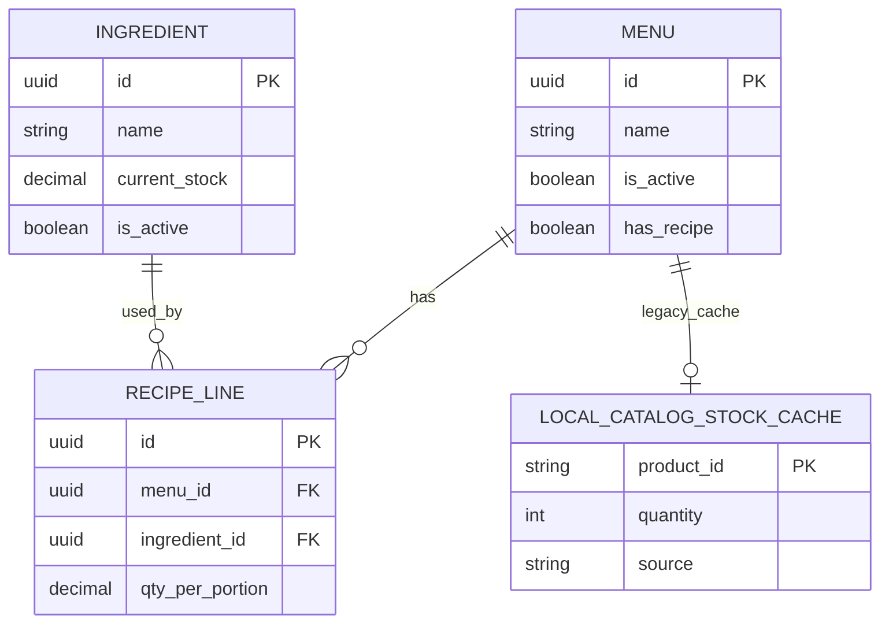

# Analisa Masalah: Admin Sudah Tambah Bahan Baku & Resep, Tapi `Es Teh` di Kasir Masih `Habis`

## Konteks

Kasus yang dianalisa:
- Admin tenant sudah menambahkan bahan baku untuk `Es Teh`
- Admin tenant sudah menyusun recipe di halaman `Resep & BOM`
- Di aplikasi kasir, kartu menu `Es Teh` masih tampil dengan badge `Habis`

Stack/konteks:
- Dashboard admin tenant: Next.js / React
- Kasir: Expo / React Native
- Backend: Hono / TypeScript / Drizzle
- Domain: POS restoran / cafe

[ASUMSI]
- Menu `Es Teh` memang sudah aktif di dashboard dan muncul di endpoint `/kasir/menus`
- User mengacu pada badge `Habis` di UI kasir, bukan error checkout backend
- Data yang dilihat di screenshot adalah tenant/branch yang sama

---

## A. USER STORIES

### Epic 1 — Sinkronisasi Inventory ke Kasir

#### [P1-Must] Story 1
Sebagai admin tenant, saya ingin setelah menambah bahan baku dan recipe, status menu di kasir mencerminkan kondisi stok yang benar agar kasir tidak melihat status `Habis` yang salah.

✅ AC1: Perubahan bahan baku dan recipe di dashboard mempengaruhi status menu di kasir.
✅ AC2: Status `Habis` di kasir tidak berasal dari data mock/local yang tidak sinkron.
✅ AC3: Jika menu masih available, kasir dapat menambahkan item ke cart.
❌ Out of scope: auto forecasting stok.

#### [P1-Must] Story 2
Sebagai kasir, saya ingin badge stok menu di aplikasi kasir berasal dari source of truth backend agar keputusan jual/tidak jual akurat.

✅ AC1: Badge `Habis` tidak lagi ditentukan oleh MMKV/local mock.
✅ AC2: Menu unavailable hanya disabled jika backend memang menyatakan unavailable.
✅ AC3: Menambah bahan baku dan recipe di dashboard dapat mengubah status availability di kasir setelah refresh.
❌ Out of scope: offline-first inventory sync.

### Epic 2 — Konsistensi Perhitungan Recipe

#### [P1-Must] Story 3
Sebagai sistem, saya ingin perhitungan ketersediaan menu berbasis recipe dan stok bahan baku agar badge `Habis` punya dasar yang benar.

✅ AC1: Jika `Es Teh` butuh `Teh 1000 sachet` dan `Gula 1000 gram`, sistem sadar bahwa requirement recipe sangat besar.
✅ AC2: Jika stok bahan baku cukup, menu tidak ditandai habis.
✅ AC3: Jika stok bahan baku tidak cukup, alasan `Habis` dapat dijelaskan.
❌ Out of scope: cost optimization / HPP lanjutan.

---

## B. ERD

### Entitas Terkait

Entitas: Menu
- id (PK, UUID)
- tenant_id (FK)
- category_id (FK)
- name (string)
- price (number)
- is_active (boolean)
- has_recipe (boolean)

Entitas: Ingredient
- id (PK, UUID)
- tenant_id (FK)
- branch_id (FK, nullable)
- name (string)
- unit (string)
- current_stock (decimal)
- is_active (boolean)

Entitas: RecipeLine
- id (PK, UUID)
- menu_id (FK)
- menu_variant_id (FK, nullable)
- ingredient_id (FK)
- qty_per_portion (decimal)

Entitas: LocalCatalogStockCache
- product_id (string)
- quantity (number)
- source (local MMKV)

Relasi:
- Menu 1:N RecipeLine
- Ingredient 1:N RecipeLine
- Menu 1:1 LocalCatalogStockCache `[LEGACY / tidak boleh jadi source produksi]`

### Mermaid ERD

---

## C. TECHNICAL SPEC / PRD

# Analisa Root Cause `Es Teh` Masih `Habis` — Technical Spec

## 1. Overview

Masalah utama bukan karena admin gagal menambahkan bahan baku atau gagal menyimpan recipe. Masalah utama ada pada mismatch source of truth di kasir.

### Temuan utama

1. `satset-kasir` masih memakai `catalogStockAtom` sebagai penentu badge stok.
2. `catalogStockAtom` dibangun dari data mock lokal `catalog.data.ts`, bukan dari ingredient/recipe backend.
3. Nilai ini disimpan di MMKV dan persisten antar session.
4. Jadi walaupun admin menambah bahan baku atau recipe di dashboard, badge `Habis` di kasir tidak otomatis berubah karena kasir tidak menghitung ulang dari backend.
5. Endpoint `/kasir/menus` saat ini belum benar-benar menghitung availability dari recipe + ingredient stock. Saat ini `isAvailable` pada dasarnya hanya mengikuti `menu.isActive`.

### Implikasi

Ada dua lapis mismatch:
- lapis 1: UI kasir masih membaca stok lokal lama
- lapis 2: backend belum punya stock-engine menu availability yang berbasis recipe

Selain itu, dari screenshot recipe:
- `Teh = 1.000 sachet`
- `Gula = 1.000 gram`

Ini berarti secara bisnis, jika `qtyPerPortion` memang dibaca literal sebagai 1000 per porsi, maka satu gelas `Es Teh` butuh stok yang sangat besar. Jadi ada kemungkinan kedua:
- status `Habis` di kasir saat ini salah karena cache lokal
- namun jika nanti availability dihitung benar dari recipe, `Es Teh` tetap bisa dinilai unavailable bila stok ingredient tidak cukup

## 2. Goals & Non-Goals

### Goals
- Menemukan akar masalah badge `Habis` yang salah.
- Menentukan apakah masalah berasal dari:
  - cache lokal kasir
  - availability backend
  - recipe quantity yang tidak realistis
- Menyusun rencana fix yang tepat.

### Non-Goals
- Langsung mengubah seluruh engine inventory.
- Membahas pricing/HPP secara mendalam.
- Membuat offline sync inventory.

## 3. Aktor & Permission

| Aktor | Akses |
|-------|-------|
| Admin Tenant | CRUD bahan baku, menu, recipe |
| Kasir | Read menu dan jual produk |
| Backend | Menyediakan menu data dan logic recipe/inventory |

## 4. Functional Requirements

FR-01: Badge stok di kasir tidak boleh berasal dari mock/local stock cache untuk flow produksi.

FR-02: Menu availability produksi harus punya source of truth yang jelas.

FR-03: Jika menggunakan recipe-based availability, sistem harus membandingkan:
- stok ingredient tersedia
- qty ingredient per portion

FR-04: Recipe qty yang abnormal harus bisa terdeteksi saat QA/UAT.

FR-05: Perubahan bahan baku dan recipe di dashboard harus bisa tercermin di kasir setelah refresh data.

## 5. Non-Functional Requirements

- Consistency: dashboard dan kasir harus membaca logika inventory yang sama.
- Explainability: jika menu unavailable, alasannya harus bisa dijelaskan.
- Maintainability: tidak boleh ada dependency tersembunyi ke seed/mock data lama.

## 6. API Endpoints

| Method | Endpoint | Deskripsi | Auth |
|--------|----------|-----------|------|
| GET | `/admin/inventory/ingredients` | list bahan baku | ✅ |
| GET | `/admin/catalog/recipes/:menuId` | detail recipe menu | ✅ |
| PUT | `/admin/catalog/recipes/:menuId` | update recipe | ✅ |
| GET | `/kasir/menus` | daftar menu kasir | ✅ |

## 7. Root Cause Analysis

### Root Cause 1 — Kasir masih pakai local stock cache

File:
- `/Users/rofisudiyono/Documents/Project/satset-pos/satset-kasir/src/features/catalog/store/catalog.store.ts`

Temuan:
- `catalogStockAtom` diinisialisasi dari `catalogProducts` mock
- status `empty -> 0`, `low -> 5`, `normal -> 50`
- state ini persisten di MMKV

Dampak:
- produk bisa tetap `Habis` walaupun backend/dashboard sudah berubah
- perubahan bahan baku dan recipe tidak menyentuh cache lokal ini

### Root Cause 2 — Availability backend belum recipe-based

File:
- `/Users/rofisudiyono/Documents/Project/satset-pos/satset-api/src/routes/kasir/menus.route.ts`

Temuan:
- response `/kasir/menus` saat ini mengirim:
  - `isAvailable: menu.isActive`
  - `availabilityReason: ACTIVE/INACTIVE`
- belum ada kalkulasi dari:
  - `recipeLines`
  - `ingredients.currentStock`

Dampak:
- backend belum bisa menyatakan `menu habis karena ingredient tidak cukup`
- frontend kasir masih memakai workaround local stock

### Root Cause 3 — Recipe qty kemungkinan tidak realistis

Screenshot recipe menunjukkan:
- `Teh = 1.000 sachet`
- `Gula = 1.000 gram`

Kemungkinan:
- nilai `1.000` dimaksudkan sebagai `1`
- tetapi sistem kemungkinan membacanya sebagai seribu

Dampak:
- jika nanti recipe-based stock engine aktif, `Es Teh` tetap akan dianggap tidak cukup stok kecuali inventory sangat besar

### Root Cause 4 — Badge `Habis` saat ini tidak membuktikan stok ingredient backend

File:
- `/Users/rofisudiyono/Documents/Project/satset-pos/satset-kasir/src/features/pos/screens/InputManualScreen.tsx`

Temuan:
- menu dipetakan dari `/kasir/menus`
- lalu masih dioverride oleh `catalogStockAtom`
- jika local quantity = 0, UI jadi `empty/habis`

Kesimpulan:
- badge `Habis` yang Anda lihat saat ini lebih mungkin berasal dari cache lokal kasir, bukan bukti bahwa bahan baku backend memang habis

## 8. Risiko & Mitigasi

| Risiko | Dampak | Mitigasi |
|--------|--------|----------|
| Tim mengira recipe gagal | fixing dilakukan di titik yang salah | fokus dulu ke source of truth availability |
| Cache MMKV lama tetap aktif | hasil UI tetap salah walau backend dibenerin | reset/migrasi cache stok lokal |
| Qty recipe salah input (`1000`) | menu tetap unavailable setelah engine benar | validasi/QA recipe quantity |
| Backend belum recipe-aware | frontend tetap butuh workaround | tambahkan availability calculator di API |

## 9. Open Questions

- [ ] Nilai `1.000` di recipe memang dimaksudkan `1000`, atau sebenarnya ingin `1`?
- [ ] Stok bahan baku `Teh` dan `Gula` saat ini berapa tepatnya di branch yang sama?
- [ ] Apakah kasir yang diuji masih menyimpan MMKV lama dari state sebelum data admin diubah?

---

## D. CODING PROMPTS

--- PROMPT: hapus dependency badge stok ke cache lokal ([MOBILE]) ---
Stack: Expo + React Native + TypeScript + Jotai
Context: `satset-kasir` masih memakai `catalogStockAtom` untuk menentukan badge `Habis`, padahal admin sudah mengelola inventory dan recipe di backend.

Task:
Refactor flow `Input Manual` agar badge availability produksi tidak lagi ditentukan oleh `catalogStockAtom`.

Requirements:
- Jangan pakai `catalogStockAtom` sebagai source utama stock status untuk menu produksi.
- Gunakan field `isAvailable` dan `availabilityReason` dari API sebagai baseline.
- Jika tetap perlu local cache, batasi hanya sebagai display hint non-authoritative.
- Tambahkan migrasi/reset MMKV lama jika diperlukan agar produk yang dulu `0` tidak terus tampil habis.

Expected output:
- Update `InputManualScreen`
- Update state source of truth stock/availability
- Dokumentasi migrasi cache lama

Notes:
- Gunakan TypeScript
- Jangan break flow cart existing
--- END PROMPT ---

--- PROMPT: hitung menu availability dari recipe dan ingredient ([BACKEND]) ---
Stack: Hono + TypeScript + Drizzle
Context: `/kasir/menus` saat ini hanya memakai `menu.isActive` untuk `isAvailable`, belum memperhitungkan recipe dan stok ingredient.

Task:
Tambahkan recipe-based availability pada endpoint `/kasir/menus`.

Requirements:
- Untuk tiap menu, ambil recipe line aktif.
- Hitung apakah stok ingredient cukup untuk minimal 1 porsi.
- Jika tidak cukup, return:
  - `isAvailable = false`
  - `availabilityReason = "OUT_OF_STOCK"`
- Jika menu inactive:
  - `availabilityReason = "INACTIVE"`
- Pertimbangkan variant jika recipe variant dipakai.

Expected output:
- Route `/kasir/menus` yang lebih akurat
- DTO availability yang konsisten
- Unit/integration test untuk minimal 3 scenario

Notes:
- Gunakan TypeScript
- Hindari query N+1 berlebihan bila memungkinkan
--- END PROMPT ---

--- PROMPT: validasi recipe quantity abnormal ([FRONTEND]) ---
Stack: Next.js + React + TypeScript
Context: Di `Resep & BOM`, admin bisa memasukkan qty per portion yang berisiko tidak realistis, misalnya `1000 sachet` untuk satu gelas es teh.

Task:
Tambahkan guard UX dan validasi untuk mendeteksi qty recipe yang abnormal.

Requirements:
- Tambahkan warning jika qty sangat besar untuk unit tertentu.
- Beri helper text contoh pengisian yang benar.
- Jangan blokir save jika rule bisnis belum final, tapi tampilkan warning yang jelas.

Expected output:
- UI warning recipe
- Validasi ringan di form
- Catatan untuk QA/UAT

Notes:
- Gunakan TypeScript
- Preserve flow page yang ada
--- END PROMPT ---

--- PROMPT: regression verification untuk kasus es teh habis ([TESTING]) ---
Stack: Manual QA + API verification
Context: User melaporkan setelah menambah bahan baku dan recipe, menu `Es Teh` di kasir masih tampil `Habis`.

Task:
Buat test langkah demi langkah untuk membedakan apakah masalah berasal dari:
- recipe
- ingredient stock
- backend availability
- cache lokal kasir

Requirements:
- Verifikasi stok ingredient aktual
- Verifikasi response `/kasir/menus`
- Verifikasi MMKV/local cache pada device kasir
- Verifikasi recipe qty per portion

Expected output:
- checklist investigasi
- expected result tiap step
- root cause decision tree

Notes:
- Fokus pada reproduksi bug nyata
--- END PROMPT ---

---

## 🗺️ Recommended Implementation Order

Sprint 1 (Diagnosis Cepat):
1. Cek response `/kasir/menus` untuk `Es Teh`
2. Reset MMKV/cache kasir dan retest
3. Verifikasi stok ingredient aktual + qty recipe

Sprint 2 (Fix Source of Truth):
1. Lepas dependency badge stok dari `catalogStockAtom`
2. Jadikan backend sebagai source of truth availability
3. Tampilkan alasan unavailable yang jelas

Sprint 3 (Hardening):
1. Tambahkan recipe-based availability di backend
2. Tambahkan warning qty recipe abnormal
3. Tambahkan test regression untuk kasus `Es Teh`

## ⚠️ Pertanyaan untuk Klien / Klarifikasi

1. Nilai `1.000` di recipe `Teh` dan `Gula` memang disengaja sebagai seribu, atau maksudnya satu?
2. Setelah perubahan data admin, apakah aplikasi kasir sudah di-refresh penuh / cache device sudah dibersihkan?
3. Apakah Anda ingin availability menu dihitung dari stok bahan baku secara real-time, atau cukup dari flag manual admin dulu?

## 💡 Saran Teknis

- Jangan memperbaiki issue ini dari sisi dashboard dulu; recipe Anda kemungkinan sudah tersimpan.
- Periksa dulu `response /kasir/menus` dan MMKV kasir, karena badge `Habis` saat ini masih sangat mungkin berasal dari cache lokal.
- Setelah itu, prioritaskan migrasi availability ke backend-driven logic agar kasus seperti ini tidak terulang.

## Asumsi yang Dipakai

- Menu `Es Teh` sudah aktif dan punya recipe tersimpan.
- Badge `Habis` yang terlihat berasal dari UI katalog kasir, bukan hasil validasi checkout backend.
- Device kasir mungkin menyimpan state MMKV dari sesi sebelumnya.

Ada bagian yang ingin diubah, diperdalam, atau ditambahkan?
