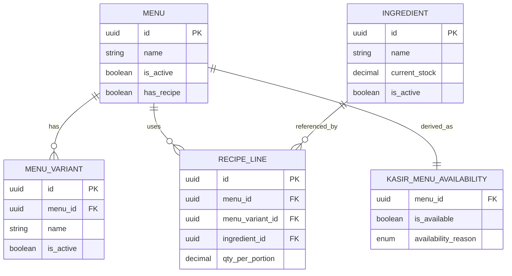

# Analisa Masalah: `Nasi Goreng` Ikut Enable Padahal Bahan Belum Ditambahkan

## Konteks

Kasus yang dianalisa:
- Setelah fix sebelumnya, `Es Teh` tidak lagi salah `Habis` karena cache lokal kasir sudah diputus.
- Namun sekarang `Nasi Goreng` ikut `enable`, padahal bahan baku / recipe-nya belum ditambahkan.
- Hasil yang diharapkan user: `Nasi Goreng` seharusnya tidak bisa dijual / tampil sebagai unavailable.

Konteks teknis:
- Dashboard admin tenant mengelola `bahan baku`, `menu`, dan `resep`
- Kasir mengambil daftar menu dari endpoint `/kasir/menus`
- Backend saat ini belum menghitung availability menu berdasarkan recipe dan stok ingredient

[ASUMSI]
- `Nasi Goreng` sudah aktif sebagai menu di dashboard
- `Nasi Goreng` belum punya recipe valid atau belum punya ingredient yang cukup
- User mengharapkan aturan bisnis: menu tanpa bahan/recipe tidak boleh dijual

---

## A. USER STORIES

### Epic 1 — Menu Availability Berdasarkan Recipe

#### [P1-Must] Story 1
Sebagai admin tenant, saya ingin menu yang belum memiliki recipe atau bahan baku yang cukup tampil unavailable di kasir agar kasir tidak menjual menu yang belum siap diproduksi.

✅ AC1: Menu tanpa recipe tidak bisa dijual di kasir.
✅ AC2: Menu dengan recipe tapi ingredient tidak cukup tidak bisa dijual di kasir.
✅ AC3: Menu dengan recipe valid dan stok cukup tetap bisa dijual.
❌ Out of scope: perhitungan cost/HPP detail.

#### [P1-Must] Story 2
Sebagai kasir, saya ingin status enable/disable menu di aplikasi berasal dari kondisi backend yang sesuai recipe dan stok agar saya tidak salah menjual menu.

✅ AC1: Menu aktif tidak otomatis berarti menu available.
✅ AC2: Kasir menerima alasan availability yang jelas, misalnya `NO_RECIPE` atau `OUT_OF_STOCK`.
✅ AC3: Kartu menu yang unavailable tetap bisa ditandai disabled dengan pesan yang konsisten.
❌ Out of scope: rekomendasi pengganti menu.

### Epic 2 — Konsistensi Admin dan Kasir

#### [P1-Must] Story 3
Sebagai sistem, saya ingin dashboard admin dan kasir berbagi aturan availability yang sama agar status menu tidak bertentangan antar aplikasi.

✅ AC1: `hasRecipe` mempengaruhi availability runtime di kasir.
✅ AC2: Recipe line dan ingredient stock dipakai dalam perhitungan availability.
✅ AC3: Menu aktif tetapi tanpa recipe tidak lagi otomatis `enable`.
❌ Out of scope: offline cache availability.

---

## B. ERD

### Entitas Terkait

Entitas: Menu
- id (PK, UUID)
- tenant_id (FK)
- category_id (FK)
- name (string)
- is_active (boolean)
- has_recipe (boolean)

Entitas: MenuVariant
- id (PK, UUID)
- menu_id (FK)
- name (string)
- is_active (boolean)

Entitas: RecipeLine
- id (PK, UUID)
- menu_id (FK)
- menu_variant_id (FK, nullable)
- ingredient_id (FK)
- qty_per_portion (decimal)

Entitas: Ingredient
- id (PK, UUID)
- tenant_id (FK)
- branch_id (FK, nullable)
- name (string)
- current_stock (decimal)
- is_active (boolean)

Entitas: KasirMenuAvailability
- menu_id (FK)
- is_available (boolean)
- availability_reason (enum)

Relasi:
- Menu 1:N RecipeLine
- Menu 1:N MenuVariant
- Ingredient 1:N RecipeLine
- Menu 1:1 KasirMenuAvailability

### Mermaid ERD

---

## C. TECHNICAL SPEC / PRD

# Analisa Root Cause `Nasi Goreng` Masih Enable — Technical Spec

## 1. Overview

Setelah perubahan sebelumnya, kasir sekarang mengikuti availability dari backend, bukan lagi cache stok lokal. Itu menyelesaikan kasus `Es Teh` yang salah `Habis`.

Namun masalah berikutnya muncul:
- `Nasi Goreng` ikut enable walaupun bahan baku/recipe belum ada

Ini menunjukkan bahwa source of truth availability di backend masih terlalu dangkal.

## 2. Goals & Non-Goals

### Goals
- Menjelaskan kenapa menu tanpa bahan tetap enable.
- Menentukan aturan availability menu yang benar.
- Menyusun kontrak backend/frontend agar menu tanpa recipe tidak bisa dijual.

### Non-Goals
- Implementasi penuh kitchen production planning.
- Multi-branch reservation stok.
- Optimasi query lanjutan di luar kebutuhan availability dasar.

## 3. Aktor & Permission

| Aktor | Akses |
|-------|-------|
| Admin Tenant | CRUD menu, ingredient, recipe |
| Kasir | Read menu available/unavailable dan menjual menu |
| Backend | Menentukan availability runtime menu |

## 4. Functional Requirements

FR-01: `isActive` tidak boleh menjadi satu-satunya penentu `isAvailable`.

FR-02: Menu tanpa recipe harus mengembalikan:
- `isAvailable = false`
- `availabilityReason = "NO_RECIPE"`

FR-03: Menu dengan recipe tetapi stok ingredient tidak cukup harus mengembalikan:
- `isAvailable = false`
- `availabilityReason = "OUT_OF_STOCK"`

FR-04: Menu inactive harus mengembalikan:
- `isAvailable = false`
- `availabilityReason = "INACTIVE"`

FR-05: Menu dengan recipe valid dan stok ingredient cukup harus mengembalikan:
- `isAvailable = true`
- `availabilityReason = "ACTIVE"`

FR-06: Frontend kasir harus disable menu berdasarkan `isAvailable`.

## 5. Non-Functional Requirements

- Consistency: hasil dashboard dan kasir tidak boleh bertentangan.
- Explainability: alasan unavailable harus eksplisit.
- Maintainability: logika availability tidak boleh tersembunyi di frontend saja.

## 6. API Endpoints

| Method | Endpoint | Deskripsi | Auth |
|--------|----------|-----------|------|
| GET | `/admin/catalog/recipes/:menuId` | lihat recipe menu | ✅ |
| PUT | `/admin/catalog/recipes/:menuId` | simpan recipe menu | ✅ |
| GET | `/admin/inventory/ingredients` | lihat bahan baku | ✅ |
| GET | `/kasir/menus` | daftar menu kasir + availability | ✅ |

## 7. Root Cause Analysis

### Root Cause 1 — Backend `/kasir/menus` hanya memakai `menu.isActive`

File:
- `/Users/rofisudiyono/Documents/Project/satset-pos/satset-api/src/routes/kasir/menus.route.ts`

Temuan:
- response saat ini:
  - `isAvailable: menu.isActive`
  - `availabilityReason: ACTIVE/INACTIVE`
- tidak ada kalkulasi:
  - apakah menu punya recipe
  - apakah ingredient stock cukup

Dampak:
- semua menu aktif akan ikut enable di kasir
- termasuk `Nasi Goreng` yang belum punya bahan/recipe

### Root Cause 2 — `hasRecipe` belum dipakai sebagai rule availability

File:
- `/Users/rofisudiyono/Documents/Project/satset-pos/satset-api/src/routes/admin/catalog/recipes.route.ts`

Temuan:
- backend sebenarnya sudah menyimpan `menu.hasRecipe`
- tetapi field ini hanya jadi metadata
- belum diintegrasikan ke logic `/kasir/menus`

Dampak:
- status `Sudah ada resep / Belum ada resep` di dashboard tidak mempengaruhi runtime kasir

### Root Cause 3 — Frontend kasir sekarang benar mengikuti backend

File:
- `/Users/rofisudiyono/Documents/Project/satset-pos/satset-kasir/src/features/pos/screens/InputManualScreen.tsx`

Temuan:
- setelah fix sebelumnya, kasir tidak lagi menentukan `habis/normal` dari cache stok lokal
- sekarang `stockStatus` diturunkan dari `menu.isAvailable`

Kesimpulan:
- perilaku `Nasi Goreng` yang enable bukan bug frontend baru
- itu justru bukti frontend sekarang mengikuti backend, sementara backend belum punya rule availability yang benar

### Root Cause 4 — Rule bisnis availability belum dibekukan sepenuhnya

Masih ada dua kemungkinan rule:

Rule A:
- menu tanpa recipe = tetap bisa dijual, karena recipe hanya untuk stock tracking

Rule B:
- menu tanpa recipe = tidak boleh dijual, karena recipe wajib untuk availability produksi

Dari keluhan user:
- ekspektasi user jelas mengarah ke **Rule B**

## 8. Risiko & Mitigasi

| Risiko | Dampak | Mitigasi |
|--------|--------|----------|
| Menu aktif tanpa recipe tetap dijual | kasir menjual menu yang tidak bisa diproduksi | jadikan `NO_RECIPE` sebagai unavailable |
| Frontend mencoba memutuskan sendiri availability | logic terpecah lagi | semua availability dihitung di backend |
| Variant recipe tidak diperhitungkan | menu variant tertentu salah enable | hitung availability per variant scope |
| Ingredient branch-scoped tidak diperhitungkan | stok salah baca lintas cabang | enforce branch-aware stock lookup |

## 9. Open Questions

- [ ] Apakah semua menu wajib punya recipe sebelum bisa dijual?
- [ ] Untuk menu bundle, apakah availability dihitung dari seluruh item bundle?
- [ ] Jika recipe kosong tapi admin memang ingin menjual menu, apakah perlu override manual availability?

---

## D. CODING PROMPTS

--- PROMPT: backend availability menu berbasis recipe ([BACKEND]) ---
Stack: Hono + TypeScript + Drizzle
Context: `/kasir/menus` saat ini meng-enable semua menu aktif, termasuk menu yang belum punya bahan/recipe seperti `Nasi Goreng`.

Task:
Refactor endpoint `/kasir/menus` agar availability menu dihitung dari `isActive`, `hasRecipe`, `recipeLines`, dan `ingredient.currentStock`.

Requirements:
- Jika `menu.isActive = false`, return `isAvailable = false`, `availabilityReason = "INACTIVE"`.
- Jika `menu.hasRecipe = false` atau recipe line kosong, return `isAvailable = false`, `availabilityReason = "NO_RECIPE"`.
- Jika recipe ada tapi ingredient tidak cukup untuk minimal 1 porsi, return `isAvailable = false`, `availabilityReason = "OUT_OF_STOCK"`.
- Jika semua valid, return `isAvailable = true`, `availabilityReason = "ACTIVE"`.
- Pertimbangkan variant recipe dan branch scope ingredient.

Expected output:
- Update route `/kasir/menus`
- Helper availability calculator
- Test scenario minimal untuk `NO_RECIPE`, `OUT_OF_STOCK`, dan `ACTIVE`

Notes:
- Gunakan TypeScript
- Hindari query N+1 bila memungkinkan
--- END PROMPT ---

--- PROMPT: frontend disable state berdasarkan availabilityReason ([MOBILE]) ---
Stack: Expo + React Native + TypeScript
Context: Setelah backend availability dibetulkan, kasir harus menampilkan state disabled yang sesuai untuk menu seperti `Nasi Goreng`.

Task:
Perjelas tampilan kartu menu unavailable di kasir.

Requirements:
- Jika `availabilityReason = "NO_RECIPE"`, tampilkan badge yang jelas.
- Jika `availabilityReason = "OUT_OF_STOCK"`, tampilkan badge `Habis`.
- Jika `availabilityReason = "INACTIVE"`, tampilkan badge `Tidak Aktif`.
- Tombol add harus disabled untuk semua unavailable state.

Expected output:
- Update `ProductCard`
- Mapping label UI dari `availabilityReason`
- Konsistensi visual antar kategori

Notes:
- Gunakan TypeScript
- Jangan ubah flow cart yang sudah benar
--- END PROMPT ---

--- PROMPT: validasi bisnis menu tanpa recipe ([FRONTEND]) ---
Stack: Next.js + React + TypeScript
Context: Dashboard saat ini bisa menampilkan status `Belum ada resep`, tetapi itu belum mengunci runtime kasir.

Task:
Tambahkan guard UX di dashboard untuk menu aktif tanpa recipe.

Requirements:
- Tampilkan warning jelas pada menu yang aktif tetapi belum punya recipe.
- Tambahkan CTA cepat ke halaman `Resep & BOM`.
- Jangan ubah source of truth availability di frontend; ini hanya guidance UX admin.

Expected output:
- Warning UI di halaman menu
- State visual `aktif tapi belum siap jual`

Notes:
- Gunakan TypeScript
- Preserve pola UI admin yang ada
--- END PROMPT ---

--- PROMPT: regression test untuk menu tanpa bahan ([TESTING]) ---
Stack: Manual QA + API verification
Context: `Nasi Goreng` ikut enable walaupun bahan baku belum ada.

Task:
Buat regression test untuk memastikan menu tanpa recipe atau tanpa stok ingredient tidak lagi enable di kasir.

Requirements:
- Test menu aktif tanpa recipe -> `NO_RECIPE`
- Test menu aktif dengan recipe tapi stok ingredient kosong -> `OUT_OF_STOCK`
- Test menu aktif dengan recipe dan stok cukup -> `ACTIVE`
- Test menu inactive -> `INACTIVE`

Expected output:
- checklist langkah uji
- expected result tiap scenario
- mapping response `/kasir/menus` yang diharapkan

Notes:
- Fokus pada end-to-end consistency
--- END PROMPT ---

---

## 🗺️ Recommended Implementation Order

Sprint 1 (Rule Freeze):
1. Bekukan rule bisnis bahwa menu tanpa recipe tidak boleh dijual
2. Tetapkan mapping `availabilityReason`

Sprint 2 (Backend Core):
1. Refactor `/kasir/menus` untuk recipe-based availability
2. Tambahkan test untuk `NO_RECIPE`, `OUT_OF_STOCK`, `ACTIVE`

Sprint 3 (Frontend Polish):
1. Perjelas badge unavailable di kasir
2. Tambahkan warning di dashboard untuk menu aktif tanpa recipe

## ⚠️ Pertanyaan untuk Klien / Klarifikasi

1. Apakah semua menu wajib punya recipe sebelum bisa dijual?
2. Jika ada menu non-inventory seperti air putih, apakah tetap wajib recipe?
3. Apakah `Nasi Goreng` yang belum punya bahan harus hidden total, atau tetap tampil disabled?

## 💡 Saran Teknis

- Bug ini jangan diperbaiki dengan cache frontend lagi; sumber masalah sekarang ada di backend availability rule.
- Gunakan `hasRecipe` sebagai gate minimal dulu, baru lanjut ke kalkulasi ingredient stock.
- Setelah backend siap, frontend cukup menjadi renderer dari `availabilityReason`.

## Asumsi yang Dipakai

- Rule bisnis yang diinginkan adalah: menu tanpa recipe/bahan tidak boleh dijual.
- `Nasi Goreng` saat ini aktif secara menu, tetapi belum siap secara produksi.
- Kasir sudah benar mengikuti response backend yang ada sekarang.

Ada bagian yang ingin diubah, diperdalam, atau ditambahkan?
