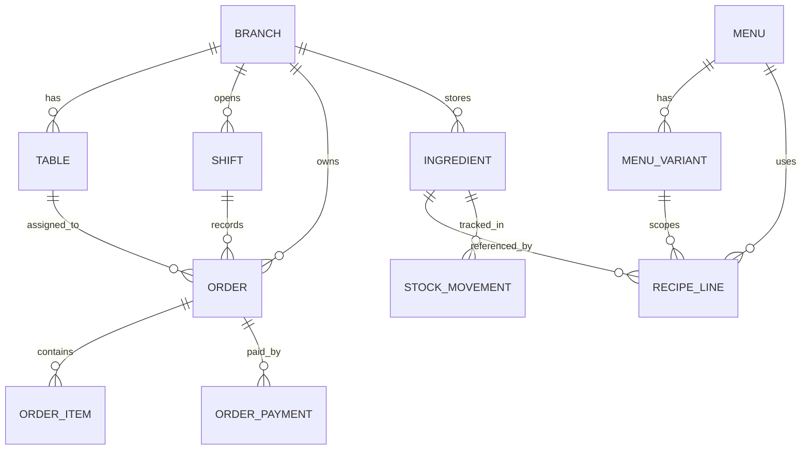

# Analisa Ketidaksesuaian Flow `satset-api` / `satset-dashboard` / `satset-kasir`

## Konteks

Analisa ini fokus pada flow bisnis berikut:

1. Admin memasukkan bahan dan stok.
2. Admin membuat menu makanan/minuman.
3. Admin membuat resep dari menu + bahan.
4. Saat order dibayar, stok bahan baku harus berkurang sesuai resep.
5. Admin membuat meja di dalam cabang.
6. Saat ada manual order, kasir harus memilih meja sebelum pembayaran.

[ASUMSI]
- `satset-dashboard` adalah panel admin tenant.
- `satset-kasir` adalah aplikasi POS kasir.
- `satset-api` adalah source of truth backend.
- Analisa ini berbasis implementasi yang ada saat ini, bukan target ideal.

---

## A. User Stories

### Epic 1 — Inventory dan Recipe Management

#### [P1-Must] Story 1
Sebagai admin, saya ingin menambahkan bahan baku beserta stok awal agar bahan dapat dipakai dalam resep dan dikurangi saat penjualan.

✅ AC1: Admin dapat membuat bahan baku dengan nama, unit, min threshold, branch, dan stok awal.
✅ AC2: Perubahan stok tercatat sebagai stock movement.
✅ AC3: Bahan baku dapat dipilih saat menyusun resep menu.
❌ Out of scope: forecasting pembelian otomatis.

#### [P1-Must] Story 2
Sebagai admin, saya ingin membuat resep untuk menu atau varian menu agar konsumsi bahan baku saat order bisa dihitung otomatis.

✅ AC1: Admin dapat mengaitkan satu menu ke banyak bahan baku.
✅ AC2: Admin dapat mengatur resep per menu dasar atau per variant.
✅ AC3: Backend menyimpan resep sebagai source of truth tunggal.
❌ Out of scope: costing lanjutan multi-batch.

#### [P1-Must] Story 3
Sebagai sistem, saya ingin mengurangi stok bahan baku sesuai resep ketika order sudah dibayar agar inventory akurat.

✅ AC1: Stok berkurang per ingredient berdasarkan `qtyPerPortion * qty order`.
✅ AC2: Rollback stok terjadi saat order dibatalkan/refund.
✅ AC3: Pengurangan stok tercatat di stock movement.
❌ Out of scope: reservasi stok sejak order dibuat tetapi belum dibayar.

### Epic 2 — Table Management dan Manual Order

#### [P1-Must] Story 4
Sebagai admin, saya ingin membuat meja per cabang agar order dine-in bisa dikaitkan ke meja yang valid.

✅ AC1: Admin dapat CRUD meja per cabang.
✅ AC2: Admin dapat mengaktifkan/nonaktifkan meja.
✅ AC3: Data meja tersedia untuk kasir berdasarkan cabang aktif.
❌ Out of scope: status okupansi meja real-time.

#### [P1-Must] Story 5
Sebagai kasir, saya ingin memilih meja dari daftar meja aktif sebelum pembayaran order manual agar transaksi dine-in konsisten dengan data operasional.

✅ AC1: Untuk `Dine In`, kasir memilih meja dari backend, bukan input bebas.
✅ AC2: Untuk `Takeaway`, meja tidak wajib.
✅ AC3: `tableId` dan `tableLabel` ikut terkirim saat checkout.
❌ Out of scope: reservasi meja otomatis.

### Epic 3 — Alignment Antar App

#### [P1-Must] Story 6
Sebagai tim produk/engineering, saya ingin `satset-api`, `satset-dashboard`, dan `satset-kasir` memakai source of truth yang sama agar flow admin dan kasir tidak berbeda perilaku.

✅ AC1: Dashboard admin membaca/menulis recipe, ingredient, table dari API.
✅ AC2: Kasir membaca menu, meja, dan checkout ke API.
✅ AC3: Tidak ada lagi recipe/stock source lokal yang mempengaruhi perilaku produksi.
❌ Out of scope: migrasi seluruh mock/demo module non-produksi.

---

## B. ERD

### Deskripsi Entitas

Entitas: Branch
- id (PK, UUID)
- tenant_id (FK)
- name (string)
- is_active (boolean)

Entitas: Table
- id (PK, UUID)
- branch_id (FK)
- label (string)
- capacity (number, nullable)
- is_active (boolean)

Entitas: Ingredient
- id (PK, UUID)
- tenant_id (FK)
- branch_id (FK, nullable)
- name (string)
- unit (string)
- current_stock (decimal)
- min_threshold (decimal)
- cost_per_unit (decimal, nullable)
- is_active (boolean)

Entitas: Menu
- id (PK, UUID)
- tenant_id (FK)
- category_id (FK)
- name (string)
- price (number)
- is_active (boolean)
- has_recipe (boolean)

Entitas: MenuVariant
- id (PK, UUID)
- menu_id (FK)
- name (string)
- price (number)
- is_active (boolean)

Entitas: RecipeLine
- id (PK, UUID)
- menu_id (FK)
- menu_variant_id (FK, nullable)
- ingredient_id (FK)
- qty_per_portion (decimal)

Entitas: Shift
- id (PK, UUID)
- tenant_id (FK)
- branch_id (FK)
- cashier_id (FK)
- shift_slot (enum)
- status (enum)

Entitas: Order
- id (PK, UUID)
- tenant_id (FK)
- branch_id (FK)
- shift_id (FK)
- source (enum: WALK_IN | WEB)
- table_id (FK, nullable)
- table_label (string, nullable)
- customer_name (string, nullable)
- status (enum)
- grand_total (number)
- stock_consumed (boolean)

Entitas: OrderItem
- id (PK, UUID)
- order_id (FK)
- menu_id (FK)
- menu_variant_id (FK, nullable)
- qty (number)
- unit_price_snapshot (number)
- note (string, nullable)

Entitas: OrderPayment
- id (PK, UUID)
- order_id (FK)
- method (enum)
- amount_paid (number)

Entitas: StockMovement
- id (PK, UUID)
- ingredient_id (FK)
- branch_id (FK)
- movement_type (enum)
- qty_change (decimal)
- reference_type (enum)
- reference_id (string)

### Relasi

- Branch 1:N Table
- Branch 1:N Shift
- Branch 1:N Order
- Ingredient N:1 Branch
- Menu 1:N MenuVariant
- Menu 1:N RecipeLine
- MenuVariant 1:N RecipeLine
- Ingredient 1:N RecipeLine
- Shift 1:N Order
- Table 1:N Order
- Order 1:N OrderItem
- Order 1:N OrderPayment
- Ingredient 1:N StockMovement

### Mermaid ERD

---

## C. Technical Spec / PRD

# Flow Alignment Inventory, Recipe, Table, dan Manual Order — Technical Spec

## 1. Overview

Saat ini backend sudah mendukung inventory, recipe, table, dan stock deduction. Namun implementasi dashboard dan kasir belum sepenuhnya aligned ke source of truth yang sama. Dampaknya:

- admin bisa mengelola data, tetapi kasir belum selalu memakai data tersebut;
- recipe di dashboard dan POS dashboard masih punya jejak source lokal;
- manual order di kasir masih memakai input meja bebas, bukan daftar meja backend;
- filtering ketersediaan menu di kasir masih berbasis state lokal, bukan status availability dari API.

## 2. Goals & Non-Goals

### Goals
- Menjadikan `satset-api` sebagai source of truth tunggal untuk ingredient, stock, recipe, table, dan order checkout.
- Menyelaraskan flow admin dashboard dengan perilaku runtime di kasir.
- Memastikan manual order dine-in memilih meja valid sebelum pembayaran.
- Memastikan pengurangan stok terjadi konsisten berdasarkan recipe backend.

### Non-Goals
- Real-time table occupancy penuh.
- Kitchen production planning.
- Inventory reservation saat order belum dibayar.
- Sinkronisasi semua module demo/mock yang tidak dipakai flow produksi.

## 3. Aktor & Permission

| Aktor | Akses |
|-------|-------|
| Admin Tenant | CRUD bahan baku, stok, menu, resep, meja, QR menu |
| Kasir | Read menu aktif, read meja aktif cabang, create order, checkout, pembayaran |
| API | Validasi, persist, stock deduction, rollback, riwayat |

## 4. Functional Requirements

FR-01: Admin dapat CRUD ingredient dari dashboard dan data tersimpan di API.

FR-02: Admin dapat melakukan stock adjustment/opname dan stock movement tercatat.

FR-03: Admin dapat menyusun recipe per menu atau per variant melalui dashboard, dan recipe disimpan di API.

FR-04: Saat order dibayar, API mengurangi stok ingredient berdasarkan recipe lines.

FR-05: Saat order cancel/refund, API mengembalikan stok ingredient yang sudah terpotong.

FR-06: Admin dapat CRUD meja per cabang melalui dashboard.

FR-07: Kasir dapat mengambil daftar meja aktif per cabang dari API.

FR-08: Pada flow manual order `Dine In`, kasir wajib memilih meja dari daftar backend sebelum masuk pembayaran.

FR-09: Pada flow manual order `Takeaway/Delivery`, meja tidak wajib.

FR-10: Kasir mengirim `tableId` dan `tableLabel` saat checkout/queue order.

FR-11: Kasir hanya menampilkan menu yang valid dijual, dengan kontrak availability yang eksplisit dari API.

## 5. Non-Functional Requirements

- Performance: daftar menu dan meja harus cached ringan di frontend, tetapi refreshable.
- Consistency: source of truth runtime tidak boleh bercabang antara local storage dan API.
- Auditability: perubahan stok wajib punya movement log.
- Maintainability: DTO menu/table/recipe harus eksplisit dan reusable di dashboard dan kasir.

## 6. API Endpoints

| Method | Endpoint | Deskripsi | Auth |
|--------|----------|-----------|------|
| GET | `/admin/inventory/ingredients` | daftar bahan baku | ✅ |
| POST | `/admin/inventory/ingredients` | buat bahan baku | ✅ |
| PATCH | `/admin/inventory/ingredients/:id` | update bahan baku | ✅ |
| POST | `/admin/inventory/stock/adjustments` | adjustment stok | ✅ |
| GET | `/admin/catalog/recipes/:menuId` | ambil resep menu/variant | ✅ |
| PUT | `/admin/catalog/recipes/:menuId` | replace recipe lines | ✅ |
| GET | `/admin/tables` | daftar meja cabang | ✅ |
| POST | `/admin/tables` | buat meja | ✅ |
| PATCH | `/admin/tables/:id` | update meja | ✅ |
| GET | `/kasir/menus` | daftar menu kasir | ✅ |
| POST | `/kasir/orders/queue` | create queued order | ✅ |
| POST | `/kasir/orders/checkout` | create paid order langsung | ✅ |
| POST | `/kasir/orders/:id/pay` | bayar ready order | ✅ |

## 7. Temuan Ketidaksesuaian Flow

### 7.1 Source of truth recipe masih bercabang

Kondisi saat ini:
- `satset-api` sudah punya route recipe admin dan stock deduction berbasis `recipeLines`.
- halaman admin recipe di dashboard sudah memakai API.
- tetapi `satset-dashboard/src/features/catalog/data/recipesStore.ts` masih menyimpan recipe di local storage.
- modul `satset-dashboard/src/features/pos/data/orderStockSync.ts` masih membaca recipe dari `recipesStore`, bukan dari API.

Dampak:
- perilaku POS di dashboard bisa berbeda dari recipe backend.
- admin merasa recipe sudah diubah, tetapi runtime lain bisa memakai data berbeda.

Keputusan:
- API harus menjadi satu-satunya source of truth recipe.
- `recipesStore` dan consumer lama harus dihapus/dimigrasikan untuk flow produksi.

### 7.2 Source of truth stok di kasir masih hybrid

Kondisi saat ini:
- API sudah mengurangi stok ingredient saat payment sukses.
- `satset-kasir` masih memakai `catalogStockAtom` untuk status `normal/low/empty`.
- status menu di `InputManualScreen` dibentuk dari stok lokal lalu item `empty` disembunyikan.
- DTO `/kasir/menus` belum membawa kontrak availability yang eksplisit.

Dampak:
- kasir bisa menyembunyikan/menampilkan menu berdasarkan state lokal, bukan kondisi backend.
- flow stok bahan baku dan flow ketersediaan menu tidak sinkron.

Keputusan:
- definisikan kontrak availability menu dari API, misalnya `isActive`, `isAvailable`, `availabilityReason`.
- kasir berhenti memakai stok lokal sebagai filter utama untuk availability produksi.

### 7.3 Flow meja admin dan kasir belum tersambung end-to-end

Kondisi saat ini:
- dashboard sudah CRUD meja via `/admin/tables`.
- API order menerima `tableId` dan `tableLabel`.
- `satset-kasir` belum terlihat mengambil daftar meja dari API.
- `CartPanel` masih memakai `tableNumber` string input bebas.

Dampak:
- manual order dine-in tidak terikat ke master meja.
- typo label meja, duplikasi meja, dan mismatch reporting sangat mungkin terjadi.

Keputusan:
- buat endpoint consumer kasir untuk read meja aktif cabang.
- ubah flow kasir dari free text menjadi picker daftar meja.

### 7.4 Pemilihan meja terjadi terlalu longgar di kasir

Kondisi saat ini:
- requirement bisnis: sebelum pembayaran manual order harus ada halaman memilih meja.
- implementasi kasir saat ini mengisi `CustomerInfoCard` di dalam panel keranjang, lalu langsung lanjut bayar.
- validasi `Dine In wajib pilih meja` belum terlihat sebagai guard backend/frontend yang kuat.

Dampak:
- flow bisnis belum match dengan requirement operasional.

Keputusan:
- tambahkan step eksplisit `Pilih Meja / Tipe Order` sebelum pembayaran.
- enforce:
  - `DINE_IN` wajib `tableId`
  - `TAKEAWAY` tidak perlu `tableId`

### 7.5 Kontrak variant recipe dan bundle perlu diuji lintas app

Kondisi saat ini:
- API recipe mendukung base recipe dan variant recipe.
- API stock deduction mempertimbangkan `menuVariantId` dan bundle items.
- kasir sudah punya variant selection.
- namun belum ada bukti kontrak test lintas dashboard-admin-recipe-kasir-checkout.

Dampak:
- potensi mismatch saat variant punya recipe berbeda.

Keputusan:
- buat integration checklist/test untuk:
  - menu base tanpa variant
  - menu dengan variant recipe
  - bundle menu
  - cancel/refund rollback

## 8. Risiko & Mitigasi

| Risiko | Dampak | Mitigasi |
|--------|--------|----------|
| Dashboard masih memakai recipe local store | stok konsumsi tidak konsisten | migrasikan semua recipe consumer ke API |
| Kasir tetap input meja bebas | reporting meja kacau | wajibkan picker meja aktif dari API |
| Availability menu tetap dari state lokal | kasir jual menu yang seharusnya unavailable | tambahkan field availability di DTO `/kasir/menus` |
| Variant recipe tidak diuji | stok deduction salah | buat integration test matrix per variant/bundle |
| Branch scoping meja/ingredient tidak konsisten | data silang cabang | enforce branchId di endpoint dan query frontend |

## 9. Open Questions

- [ ] Apakah ingredient memang branch-scoped penuh, atau ada tenant-level ingredient yang dibagi ke beberapa cabang?
- [ ] Apakah order dine-in perlu menolak checkout bila meja inactive?
- [ ] Apakah stok harus dipotong saat `queue/ready` atau tetap saat `paid` seperti implementasi sekarang?
- [ ] Apakah dashboard POS lama masih bagian dari scope produk aktif, atau bisa dianggap legacy?

---

## D. Coding Prompts

--- PROMPT: Alignment contract menu availability ([BACKEND]) ---
Stack: Node.js + Hono + TypeScript + Drizzle
Context: `satset-kasir` masih memakai state lokal untuk menentukan menu kosong/tidak tersedia, sementara source of truth harus berasal dari API.

Task:
Tambahkan kontrak availability yang eksplisit pada endpoint `/kasir/menus`.

Requirements:
- Tambahkan field `isActive`, `isAvailable`, dan `availabilityReason` pada response menu kasir.
- `isAvailable` tidak boleh diturunkan dari state lokal frontend.
- Pastikan variant inactive juga tidak dapat dipilih.
- Document DTO baru agar dashboard dan kasir dapat share kontrak yang sama.

Expected output:
- Update route `/kasir/menus`
- Update type response
- Catatan migrasi untuk consumer frontend

Notes:
- Gunakan TypeScript
- Jangan ubah semantics field existing tanpa migration note
--- END PROMPT ---

--- PROMPT: Sinkronisasi recipe source of truth ([FRONTEND]) ---
Stack: Next.js + React Query + TypeScript
Context: `satset-dashboard` masih memiliki `recipesStore` local-storage yang dipakai modul POS lama, sementara admin recipe page sudah memakai API.

Task:
Migrasikan consumer recipe di dashboard agar seluruh flow produksi memakai API recipe backend.

Requirements:
- Identifikasi semua consumer `recipesStore`.
- Hapus dependency runtime POS terhadap local-storage recipe.
- Bila perlu, buat adapter query API untuk recipe lookup.
- Pertahankan compatibility sementara hanya jika dibutuhkan, lalu tandai sebagai legacy.

Expected output:
- Refactor consumer recipe ke API
- Daftar file yang masih legacy
- Catatan cleanup

Notes:
- Gunakan React Query
- Hindari source of truth ganda
--- END PROMPT ---

--- PROMPT: Manual order table selection ([MOBILE]) ---
Stack: Expo + React Native + TypeScript + TanStack Query
Context: `satset-kasir` saat ini masih memakai input text `tableNumber`, padahal meja sudah dikelola admin di dashboard dan disimpan di API.

Task:
Ubah flow manual order dine-in agar kasir memilih meja aktif dari backend sebelum pembayaran.

Requirements:
- Tambahkan fetch daftar meja aktif berdasarkan branch kasir aktif.
- Ganti `tableNumber` free text menjadi table picker / bottom sheet.
- Untuk `Dine In`, `tableId` wajib ada sebelum checkout.
- Untuk `Takeaway`, table tidak wajib.
- Kirim `tableId` dan `tableLabel` saat checkout/queue order.

Expected output:
- Hook API meja kasir
- UI picker meja
- Validasi flow sebelum pembayaran

Notes:
- Preserve tablet UX
- Jangan hardcode daftar meja
--- END PROMPT ---

--- PROMPT: End-to-end stock deduction verification ([TESTING]) ---
Stack: API integration tests + frontend QA checklist
Context: backend sudah deduct stok dari recipe, tetapi alignment variant/bundle/table flow perlu diverifikasi lintas app.

Task:
Buat test matrix dan integration test untuk memverifikasi recipe-based stock deduction.

Requirements:
- Test create ingredient -> create menu -> create recipe -> checkout order -> stock reduced.
- Test variant recipe.
- Test bundle recipe.
- Test cancel/refund rollback.
- Test dine-in order with table assignment.

Expected output:
- Test cases
- Assertion list
- Data setup strategy

Notes:
- Fokus pada high-signal business flow
--- END PROMPT ---

---

## 🗺️ Recommended Implementation Order

### Sprint 1 — Contract Alignment
1. Bekukan keputusan bahwa API adalah source of truth tunggal untuk recipe, table, dan availability.
2. Audit semua consumer local store/mock pada dashboard dan kasir.
3. Definisikan DTO bersama untuk menu availability dan table selection.

### Sprint 2 — Dashboard/Admin Cleanup
1. Rapikan dashboard agar semua recipe consumer memakai API.
2. Pastikan meja per cabang dan ingredient per cabang konsisten.
3. Tambahkan smoke test admin flow: ingredient -> menu -> recipe -> table.

### Sprint 3 — Kasir Flow Alignment
1. Tambahkan query daftar meja aktif di kasir.
2. Ubah manual order menjadi picker meja sebelum pembayaran.
3. Hapus ketergantungan availability menu pada `catalogStockAtom` untuk flow produksi.

### Sprint 4 — Verification
1. Verifikasi stock deduction base recipe.
2. Verifikasi variant recipe dan bundle.
3. Verifikasi cancel/refund rollback.
4. Verifikasi reporting order per table.

---

## Plan TODO Prioritas

### P0 — Keputusan arsitektur
- [ ] Tetapkan `satset-api` sebagai source of truth tunggal untuk recipe, stock runtime, dan table.
- [ ] Tandai `recipesStore` di dashboard sebagai legacy dan daftar semua consumer-nya.
- [ ] Definisikan kontrak DTO bersama untuk menu kasir dan table kasir.

### P1 — Perbaikan backend contract
- [ ] Review endpoint `/kasir/menus` agar mengembalikan status availability yang eksplisit.
- [ ] Tambahkan endpoint kasir untuk read daftar meja aktif per branch, atau expose consumer-safe endpoint dari data `/admin/tables`.
- [ ] Tambahkan validasi backend: jika source/order type dine-in, `tableId` wajib valid dan aktif.

### P1 — Perbaikan dashboard
- [ ] Migrasikan semua flow recipe produksi ke API, hapus source lokal recipe untuk flow aktif.
- [ ] Pastikan halaman recipe admin dan POS admin tidak memakai data berbeda.
- [ ] Audit apakah stock report, recipe page, dan menu page memakai branch scope yang sama.

### P1 — Perbaikan kasir
- [ ] Tambahkan hook query `getTables()` di kasir.
- [ ] Ganti input `tableNumber` menjadi picker meja aktif.
- [ ] Pisahkan `Dine In` vs `Takeaway` dengan validasi yang tegas sebelum pembayaran.
- [ ] Kirim `tableId` + `tableLabel` pada `queueOrder` dan `checkoutOrder`.

### P2 — Konsistensi stok dan availability
- [ ] Hapus filter menu berbasis `catalogStockAtom` sebagai source utama availability produksi.
- [ ] Mapping availability menu ke field API yang baru.
- [ ] Tampilkan badge `unavailable` atau `inactive` daripada menghilangkan menu tanpa alasan yang jelas.

### P2 — QA dan testing
- [ ] Buat integration checklist lintas repo: ingredient -> recipe -> order -> stock movement.
- [ ] Tambahkan test scenario untuk variant recipe.
- [ ] Tambahkan test scenario untuk bundle menu.
- [ ] Tambahkan test scenario cancel/refund rollback.
- [ ] Tambahkan test scenario dine-in wajib pilih meja.

---

## ⚠️ Pertanyaan untuk Klarifikasi

1. Apakah `satset-dashboard` POS module lama masih dipakai produksi, atau hanya admin dashboard yang aktif?
2. Untuk flow bisnis Anda, stok bahan baku memang baru dipotong saat pembayaran, bukan saat order masuk dapur?
3. Apakah manual order dine-in wajib memilih `tableId` yang valid, atau cukup `tableLabel` string?

## 💡 Saran Teknis

- Jangan lanjut patch UI kasir sebelum kontrak `table` dan `menu availability` dibekukan.
- Prioritaskan menghapus source of truth ganda di dashboard karena itu akar mismatch paling berbahaya.
- Jika ingin rollout aman, lakukan dalam urutan: contract backend -> dashboard cleanup -> kasir picker meja -> integration test.

## Asumsi yang Dipakai

- `satset-api` saat ini sudah production candidate untuk inventory/order flow.
- `satset-kasir` sedang menuju konsumsi API penuh, tetapi masih menyisakan state lokal dari fase mock/offline.
- `satset-dashboard` memiliki sebagian modul legacy/demo yang belum sepenuhnya dimigrasikan ke API.

Ada bagian yang ingin diubah, diperdalam, atau ditambahkan?
