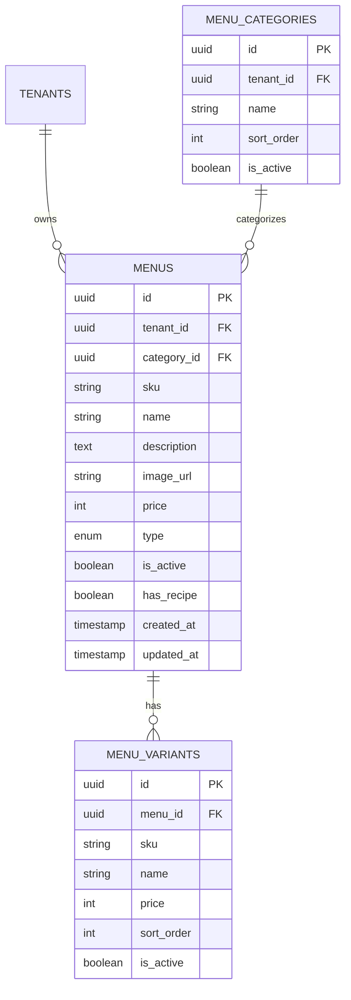

# Foto Menu Opsional — Cross-Repo Analysis

Analisis ini mencakup:
- `satset-api`: `/Users/rofisudiyono/Documents/Project/satset-platform/apps/satset-api`
- `satset-dashboard`: `/Users/rofisudiyono/Documents/Project/satset-platform/apps/satset-dashboard`
- `satset-kasir`: `/Users/rofisudiyono/Documents/Project/satset-kasir`

[ASUMSI]
- Repo dashboard yang aktif untuk flow katalog tenant adalah `satset-platform/apps/satset-dashboard`, bukan repo lama di `satset-pos/satset-dashboard`.
- Scope fitur ini adalah `menu photo optional` pada katalog menu tenant, bukan galeri multi-image atau crop/editor.
- Jika admin tidak mengisi foto, kasir tetap memakai placeholder ikon kategori seperti perilaku saat ini.

---

## A. USER STORIES

### Epic 1 — Admin Katalog Menu

**[P1-Must]** Sebagai admin tenant, saya ingin dapat mengisi foto menu saat membuat atau mengedit menu, agar menu tampil lebih representatif di dashboard, kasir, dan kanal customer.

✅ AC1: Form menu memiliki field foto yang opsional.  
✅ AC2: Admin dapat menyimpan menu tanpa foto.  
✅ AC3: Admin dapat mengubah atau menghapus foto menu saat edit.  
✅ AC4: URL/asset foto yang valid tersimpan di record menu.  
❌ Out of scope: multi-image gallery, crop editor, AI enhancement.

**[P1-Must]** Sebagai admin tenant, saya ingin preview foto menu sebelum menyimpan, agar saya yakin foto yang dipilih sudah benar.

✅ AC1: Jika foto/URL diisi, preview langsung muncul di dialog form.  
✅ AC2: Jika foto dihapus, preview kembali ke placeholder.  
✅ AC3: Jika URL/foto invalid, form menampilkan feedback error yang jelas.  
❌ Out of scope: CDN optimization pipeline lanjutan.

### Epic 2 — Backend Catalog Contract

**[P1-Must]** Sebagai sistem backend, saya ingin mengembalikan `imageUrl` pada endpoint katalog admin, kasir, dan public, agar semua client membaca data menu yang sama.

✅ AC1: `GET /api/admin/catalog/menus` mengembalikan `imageUrl`.  
✅ AC2: `GET /api/admin/catalog/menus/:id` mengembalikan `imageUrl`.  
✅ AC3: `GET /api/kasir/menus` mengembalikan `imageUrl`.  
✅ AC4: `GET /api/public/menus` mengembalikan `imageUrl`.  
❌ Out of scope: endpoint upload file generik baru jika pendekatan URL existing masih dipakai.

### Epic 3 — Kasir Rendering

**[P1-Must]** Sebagai kasir, saya ingin kartu menu menampilkan foto menu jika tersedia, agar pencarian visual menu lebih cepat.

✅ AC1: Jika `imageUrl` ada dan load sukses, kartu menu menampilkan foto.  
✅ AC2: Jika `imageUrl` kosong/null, kartu menu menampilkan placeholder default seperti sekarang.  
✅ AC3: Jika image gagal load, UI fallback ke placeholder default tanpa blank card.  
✅ AC4: Badge stok dan tombol tambah tetap bekerja pada mode foto maupun placeholder.  
❌ Out of scope: slideshow, zoom image, lazy prefetch kompleks.

### Epic 4 — Konsistensi Kanal

**[P2-Should]** Sebagai tenant/product team, saya ingin foto menu yang sama muncul di admin, kasir, dan public menu, agar branding katalog konsisten di seluruh ekosistem.

✅ AC1: Sumber data foto hanya 1 field: `menus.image_url`.  
✅ AC2: Admin table/list, kasir product card, dan public menu card membaca field yang sama.  
✅ AC3: Tidak ada hardcoded dummy image saat data backend sebenarnya tersedia.  
❌ Out of scope: per-channel image override.

---

## B. ERD

### Deskripsi Teks

Entitas: `menus`
- `id` (PK, UUID)
- `tenant_id` (FK -> tenants.id)
- `category_id` (FK -> menu_categories.id, nullable)
- `sku` (string, nullable)
- `name` (string)
- `description` (text, nullable)
- `image_url` (string, nullable)
- `price` (integer)
- `type` (enum: SINGLE|BUNDLE)
- `is_active` (boolean)
- `has_recipe` (boolean)
- `created_at` (timestamp)
- `updated_at` (timestamp)

Entitas: `menu_categories`
- `id` (PK, UUID)
- `tenant_id` (FK)
- `name` (string)

Entitas: `menu_variants`
- `id` (PK, UUID)
- `menu_id` (FK -> menus.id)
- `name` (string)
- `price` (integer)
- `sort_order` (integer)
- `is_active` (boolean)

Relasi:
- `tenant` 1:N `menus`
- `menu_categories` 1:N `menus`
- `menus` 1:N `menu_variants`

Catatan:
- Field `menus.image_url` sudah ada di schema backend saat ini.
- Gap utama ada pada serializer endpoint dan konsumsi frontend kasir/dashboard active form.

### Mermaid

---

## C. Technical Spec / PRD

# Foto Menu Opsional di Admin, API, dan Kasir — Technical Spec

## 1. Overview

Klien meminta menu dapat memiliki foto opsional. Jika foto diisi oleh admin, foto tersebut tampil pada kartu menu di aplikasi kasir. Jika tidak diisi, kasir tetap menampilkan placeholder default berbasis ikon kategori seperti sekarang.

Temuan cross-repo:
- Backend sudah punya kolom `menus.image_url` di `/Users/rofisudiyono/Documents/Project/satset-platform/apps/satset-api/src/db/schema/catalog.ts`.
- Validator backend sudah menerima `imageUrl` di `/Users/rofisudiyono/Documents/Project/satset-platform/apps/satset-api/src/validators/menu.validator.ts`.
- Kontrak dashboard admin sudah punya `imageUrl` di `/Users/rofisudiyono/Documents/Project/satset-platform/apps/satset-dashboard/src/features/catalog/catalog-api.ts`.
- Kasir belum punya `imageUrl` di tipe `KasirMenu`, `CatalogProduct`, dan `ProductCard`.
- Serializer menu untuk kasir/public belum mengembalikan `imageUrl` di `/Users/rofisudiyono/Documents/Project/satset-platform/apps/satset-api/src/lib/menus-branch.ts`.
- Form katalog dashboard yang aktif (`MenuFormDialog`) belum expose field foto; sementara ada komponen lama `MenuFormModal` yang sudah punya pola preview/upload URL.

## 2. Goals & Non-Goals

### Goals
- Menyediakan field foto menu yang opsional di dashboard katalog.
- Mengembalikan `imageUrl` dari backend untuk admin, kasir, dan public menu.
- Menampilkan foto pada kartu menu kasir jika tersedia.
- Menjaga fallback placeholder default jika foto kosong atau gagal dimuat.

### Non-Goals
- Menambah multi-image per menu.
- Menambah editor crop/compress image di client.
- Menambah storage service/CDN baru jika tidak dibutuhkan.
- Mendesain ulang total kartu menu kasir.

## 3. Aktor & Permission

| Aktor | Akses |
|-------|-------|
| Admin Tenant | Create/update/delete field foto menu |
| Kasir | Read-only melihat foto menu di katalog kasir |
| Customer Web/Public | Read-only melihat foto menu jika endpoint public ikut consume |
| Backend API | Validasi, simpan, dan serialisasi `imageUrl` |

## 4. Functional Requirements

FR-01: Dashboard admin harus menyediakan input foto menu yang opsional pada create/edit menu.  
FR-02: Admin dapat menyimpan menu tanpa foto.  
FR-03: Jika foto diisi, preview foto harus muncul di form admin.  
FR-04: Backend admin create/update menu harus menerima `imageUrl` nullable/optional.  
FR-05: Backend list/detail menu admin harus mengembalikan `imageUrl`.  
FR-06: Backend list menu kasir/public harus mengembalikan `imageUrl`.  
FR-07: Kasir harus memetakan `imageUrl` ke model `CatalogProduct`.  
FR-08: `ProductCard` kasir harus menampilkan foto jika `imageUrl` ada.  
FR-09: Jika `imageUrl` kosong/null/error, `ProductCard` menampilkan placeholder default saat ini.  
FR-10: Badge stok, status inactive, dan tombol add tetap tampil benar pada kedua mode.  

## 5. Non-Functional Requirements

- Performance: image di kasir tidak boleh membuat scroll katalog terasa berat; gunakan size tetap dan object-cover.
- Reliability: fallback placeholder harus jalan pada kondisi `null`, string kosong, atau network image gagal.
- Security: validasi input image URL tetap aman; jika memakai upload endpoint, batasi mime type dan ukuran file.
- Maintainability: source of truth tetap `menus.image_url`; hindari field baru semisal `photo`, `thumbnail`, `coverImage` tanpa alasan kuat.

## 6. API Endpoints

| Method | Endpoint | Deskripsi | Auth |
|--------|----------|-----------|------|
| GET | `/api/admin/catalog/menus` | List menu admin, harus include `imageUrl` | ✅ |
| GET | `/api/admin/catalog/menus/:menuId` | Detail menu admin, harus include `imageUrl` | ✅ |
| POST | `/api/admin/catalog/menus` | Create menu dengan `imageUrl?` | ✅ |
| PATCH | `/api/admin/catalog/menus/:menuId` | Update menu dengan `imageUrl?` | ✅ |
| GET | `/api/kasir/menus` | Menu aktif kasir, harus include `imageUrl` | ✅ |
| GET | `/api/public/menus` | Menu public/customer, sebaiknya include `imageUrl` | ✅ guest |

Catatan implementasi:
- Jika tetap memakai URL field biasa, endpoint di atas tidak perlu multipart.
- Jika ingin upload file native dari dashboard, lebih baik tambahkan endpoint upload terpisah lalu hasil URL-nya disimpan ke `imageUrl`.

## 7. Tech Stack & Arsitektur

- Backend: Bun + Hono + Drizzle + PostgreSQL
- Dashboard: React + Vite + TanStack Query
- Kasir: Expo + React Native + TanStack Query/Jotai
- Existing image field:
  - DB schema: `menus.image_url`
  - Validator: `imageUrl`
  - Admin contract: `AdminMenuRecord.imageUrl`

### Temuan Per Repo

#### Backend (`satset-api`)
- Sudah ada schema `menus.imageUrl`.
- Sudah ada validator `imageUrl`.
- Serializer `fetchSerializedMenusForBranch` belum return `imageUrl`.
- Ini berarti kasir/public belum bisa baca foto walaupun data tersimpan.

#### Dashboard (`satset-dashboard`)
- `AdminMenuRecord` dan API mutation sudah mendukung `imageUrl`.
- `useMenuMutations` belum mengirim `imageUrl` dari state form aktif.
- `MenuFormDialog` aktif belum punya input/preview foto.
- Ada referensi komponen lama `MenuFormModal` yang sudah punya UX preview/upload via file/url dan bisa dijadikan referensi implementasi.

#### Kasir (`satset-kasir`)
- `KasirMenu` belum punya `imageUrl`.
- `CatalogProduct` belum punya `imageUrl`.
- `mapMenuToCatalogProduct` belum memetakan `imageUrl`.
- `ProductCard` belum menerima/merender image network; masih placeholder kategori saja.

## 8. Risiko & Mitigasi

| Risiko | Dampak | Mitigasi |
|--------|--------|----------|
| `imageUrl` tersimpan tapi tidak diserialisasi ke kasir/public | Fitur terlihat “tidak jalan” di client | Tambah contract test/manual QA untuk `/kasir/menus` dan `/public/menus` |
| Dashboard memakai field baru lokal, backend tetap `imageUrl` | Drift contract | Gunakan hanya `imageUrl` end-to-end |
| Broken image URL | Kartu menu blank atau jelek | Tambah `onError` fallback ke placeholder default |
| Upload file langsung ke create/update menu tanpa storage flow jelas | API rumit dan rawan gagal | Fase 1 pakai URL/hasil upload existing; pisahkan upload jika memang diperlukan |
| Bundle/variant form regression saat menambah foto field | Create/edit menu existing rusak | Tambahkan foto sebagai section independen, jangan ubah behavior bundle/variant |

## 9. Open Questions

- [ ] Admin akan memasukkan foto via upload file, URL manual, atau keduanya?
- [ ] Apakah customer/public menu juga wajib menampilkan foto pada fase yang sama?
- [ ] Apakah perlu placeholder berbeda antara kategori makanan/minuman/snack saat foto kosong, atau tetap pattern saat ini?

---

## D. Coding Prompts

--- PROMPT: Menu image contract serialization ([BACKEND]) ---
Stack: Bun + Hono + Drizzle + TypeScript
Context: Tabel `menus` sudah punya field `image_url`, validator `imageUrl` juga sudah ada. Namun serializer menu untuk kasir/public belum mengembalikan field tersebut.

Task:
Update backend catalog serialization agar `imageUrl` ikut keluar konsisten pada:
- admin menu list/detail
- kasir menu list
- public menu list

Requirements:
- Gunakan field existing `menus.imageUrl`, jangan tambah kolom baru.
- Pastikan nilai nullable tetap aman (`string | null`).
- Update semua type/mapper internal yang relevan.
- Jangan mengubah behavior availability/stok/variant yang sudah ada.

Expected output:
- Response contract `imageUrl` tersedia di endpoint terkait.
- Tidak ada breaking change pada field existing.

Notes:
- Fokus utama ada di `/src/lib/menus-branch.ts` dan route/menu serializer admin.
- Tambahkan uji manual atau unit test bila project sudah punya pola test.
--- END PROMPT ---

--- PROMPT: Add optional menu image field to active admin catalog form ([FRONTEND]) ---
Stack: React + Vite + TypeScript + TanStack Query
Context: `AdminMenuRecord`, `createAdminMenu`, dan `updateAdminMenu` sudah mendukung `imageUrl`, tetapi `MenuFormDialog` dan `useMenuMutations` belum mengelola field ini.

Task:
Tambahkan field foto menu opsional pada form aktif katalog admin.

Requirements:
- Tambah state `menuImageUrl` pada page katalog menu.
- Pass prop `menuImageUrl` dan `onMenuImageUrlChange` ke `MenuFormDialog`.
- Tambahkan section preview + input URL/manual clear button.
- Jika ingin upload file, adapt pola ringan dari `MenuFormModal` lama tanpa mereintroduce seluruh komponen lama.
- Update `useMenuMutations` agar mengirim `imageUrl` ke payload create/update.
- Saat edit menu, hydrate value dari `editingItem.imageUrl`.

Expected output:
- Admin bisa create/update menu dengan atau tanpa foto.
- Preview muncul bila foto diisi.
- Flow bundle/variant tetap utuh.

Notes:
- Jangan migrate kembali ke `MenuFormModal` lama; pertahankan `MenuFormDialog` sebagai sumber aktif.
- Jaga style tetap nyambung dengan tone amber/gold katalog saat ini.
--- END PROMPT ---

--- PROMPT: Render menu image with fallback in kasir product cards ([MOBILE]) ---
Stack: Expo + React Native + TypeScript
Context: Kasir saat ini hanya menampilkan placeholder ikon kategori. Requirement baru: tampilkan foto menu jika ada, kalau tidak ada tetap placeholder default seperti sekarang.

Task:
Update kasir data flow dan `ProductCard` untuk mendukung foto menu opsional.

Requirements:
- Tambah `imageUrl?: string | null` pada `KasirMenu`, `CatalogProduct`, dan props `ProductCard`.
- Update mapper `mapMenuToCatalogProduct`.
- Render image network jika `imageUrl` tersedia.
- Jika image gagal load atau tidak ada, fallback ke placeholder kategori existing.
- Pertahankan badge stok, inactive state, dan tombol add.
- Jaga performa list: image size fixed, `resizeMode="cover"`, tidak ada layout shift.

Expected output:
- Product card menampilkan foto menu bila ada.
- Fallback visual default tetap sama seperti sekarang.

Notes:
- Pertimbangkan pakai `expo-image` bila sudah tersedia, atau `Image` RN biasa jika cukup.
- Pastikan tidak merusak tablet dan phone layout.
--- END PROMPT ---

--- PROMPT: Validate end-to-end optional menu image flow ([TESTING]) ---
Stack: Cross-repo manual/integration verification
Context: Field `imageUrl` sudah ada di DB/API contract, tetapi perlu diverifikasi end-to-end dari admin ke kasir.

Task:
Buat checklist verifikasi untuk skenario berikut:
- create menu tanpa foto
- create menu dengan foto
- edit menu menambah foto
- edit menu menghapus foto
- kasir render foto sukses
- kasir fallback saat `imageUrl` kosong
- kasir fallback saat image load error

Requirements:
- Verifikasi endpoint admin dan kasir mengembalikan `imageUrl` sesuai harapan.
- Verifikasi tidak ada regression pada variant/bundle dan ketersediaan stok.

Expected output:
- QA checklist yang bisa dijalankan product/dev.

Notes:
- Jika public menu ikut scope, tambahkan satu skenario public browse menu.
--- END PROMPT ---

---

## 🗺️ Recommended Implementation Order

### Sprint 1 (Contract Foundation)
1. Rapikan serializer backend agar `imageUrl` keluar di admin/kasir/public.
2. Update type contract kasir dan dashboard jika ada mismatch.
3. Verifikasi response API dengan sample menu yang punya/tidak punya image.

### Sprint 2 (Admin Input)
1. Tambah field foto opsional di `MenuFormDialog`.
2. Wire `menuImageUrl` ke page state dan `useMenuMutations`.
3. Tambah preview + clear action + validation ringan.

### Sprint 3 (Kasir Rendering)
1. Tambah `imageUrl` ke `KasirMenu` → `CatalogProduct` → `ProductCard`.
2. Render foto menu dan fallback placeholder.
3. QA tablet + phone + state load error image.

### Sprint 4 (Polish)
1. Jika diperlukan, perluas ke public/customer menu card.
2. Tambahkan helper upload atau asset policy jika tim memilih file upload, bukan URL manual.

---

## ⚠️ Pertanyaan untuk Klien / Klarifikasi

1. Foto menu diinput lewat upload file dari komputer, URL gambar, atau dua-duanya?
2. Apakah scope langsung mencakup customer/public menu selain kasir?
3. Apakah admin boleh menghapus foto dan kembali ke placeholder default kapan saja?

---

## 💡 Saran Teknis

- Jalur tercepat adalah memanfaatkan field existing `imageUrl` end-to-end, bukan membuat field baru `photo`/`thumbnail`.
- Untuk fase pertama, gunakan `imageUrl` sebagai kontrak utama. Jika upload file diperlukan, upload flow sebaiknya menghasilkan URL final lalu tetap menyimpan ke `imageUrl`.
- Di kasir, implementasikan fallback di level `ProductCard`, bukan di data mapping saja, supaya broken URL pun tetap aman.
- Di dashboard, referensi terbaik untuk UX preview foto adalah komponen lama `MenuFormModal`, tetapi implementasinya sebaiknya dipindah ke `MenuFormDialog` yang sekarang aktif.

