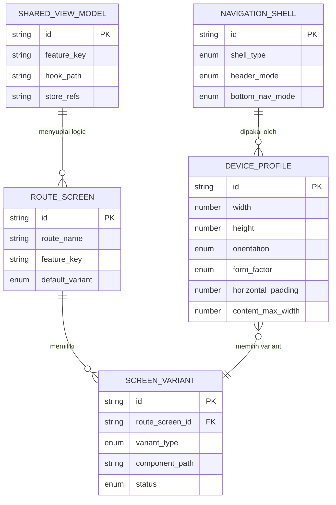

# Responsive Phone/Tablet Architecture — Technical Analysis

## Konteks Singkat

Project ini adalah app kasir berbasis `Expo Router + React Native + Tamagui + Jotai`.
Saat ini mayoritas layar masih berorientasi tablet, dengan indikasi:

- `src/features/pos/screens/InputManualScreen.tsx` masih hardcoded split `catalog | cart`
- beberapa page lain sudah mulai memakai `useResponsiveLayout()`
- root app (`src/app/_layout.tsx`) belum punya provider/context device form factor

Target requirement:

- menambahkan tampilan khusus `phone`
- memisahkan page/component `phone` dan `tablet` agar maintainable
- root project bisa mengetahui current form factor sejak awal
- route tetap konsisten, tetapi implementasi screen bisa berbeda per device

---

## [ASUMSI]

- `phone` dan `tablet` dibedakan terutama berdasarkan `window width`, bukan native device model.
- breakpoint existing `isTablet = width >= 900` akan tetap jadi baseline awal.
- route URL/navigation tidak diubah; yang berubah adalah screen implementation di balik route tersebut.
- state bisnis tetap shared, hanya presentation layer yang dipisah.
- fokus utama saat ini adalah arsitektur frontend, bukan perubahan API/backend.

---

## A. USER STORIES

### Epic 1 — Device Awareness di Root App

**[P1-Must] US-01**  
Sebagai sistem, saya ingin mendeteksi apakah app sedang berjalan pada mode `phone` atau `tablet` di root layout, agar semua route bisa memakai keputusan layout yang konsisten.

✅ AC1: Root app menyediakan source of truth tunggal untuk `formFactor`  
✅ AC2: Nilai `formFactor` dapat diakses dari screen/page/component mana pun  
✅ AC3: Perubahan orientasi/resize mengupdate state secara aman  
❌ Out of scope: device detection berbasis user-agent atau model hardware yang kompleks

**[P1-Must] US-02**  
Sebagai developer, saya ingin breakpoint device terpusat di satu module, agar perubahan threshold tidak perlu dilakukan di banyak file.

✅ AC1: Breakpoint tersimpan di shared config  
✅ AC2: Tidak ada magic number width tersebar di screen  
✅ AC3: Hook responsive existing mengikuti source config yang sama  
❌ Out of scope: responsive token per design system yang sangat detail

### Epic 2 — Pemisahan Screen Phone vs Tablet

**[P1-Must] US-03**  
Sebagai developer, saya ingin setiap route bisa merender screen variant `phone` atau `tablet` yang terpisah, agar maintenance dan refactor lebih mudah.

✅ AC1: Route tetap satu entry point  
✅ AC2: Variant `phone` dan `tablet` berada di file/folder terpisah  
✅ AC3: Shared business logic tidak diduplikasi  
❌ Out of scope: membuat route baru khusus `/phone/...` dan `/tablet/...`

**[P1-Must] US-04**  
Sebagai developer, saya ingin komponen shared dipisahkan dari komponen variant, agar logic reusable tetap bisa dipakai dua layout.

✅ AC1: Shared hook/store/mapper tetap berada di layer bersama  
✅ AC2: Hanya presentation/layout yang dipisah bila memang berbeda  
✅ AC3: Tidak ada copy-paste satu screen utuh ke dua folder tanpa shared extraction  
❌ Out of scope: refactor total seluruh feature dalam satu sprint

### Epic 3 — Konsistensi UX dan Navigasi

**[P2-Should] US-05**  
Sebagai kasir pengguna phone, saya ingin flow transaksi tetap nyaman di layar kecil, agar input produk, lihat cart, dan bayar bisa dilakukan tanpa split panel tablet.

✅ AC1: Phone layout memakai stack/sheet/tab flow yang cocok untuk layar kecil  
✅ AC2: CTA utama tetap mudah dijangkau  
✅ AC3: Tidak ada panel yang terpotong atau terlalu rapat  
❌ Out of scope: redesign total seluruh visual language

**[P2-Should] US-06**  
Sebagai kasir pengguna tablet, saya ingin layout tablet tetap mempertahankan kecepatan operasional sekarang, agar transisi ke arsitektur baru tidak mengurangi efisiensi.

✅ AC1: Layout split panel tablet tetap tersedia  
✅ AC2: Route dan perilaku utama tidak berubah untuk tablet  
✅ AC3: Tidak ada regressi pada screen tablet existing  
❌ Out of scope: optimasi performa ekstrem di luar layout split

### Epic 4 — Maintainability dan Quality

**[P2-Should] US-07**  
Sebagai developer, saya ingin ada pola folder standar untuk variant screen, agar screen baru berikutnya bisa mengikuti konvensi yang sama.

✅ AC1: Ada naming convention untuk `phone`, `tablet`, `shared`  
✅ AC2: Developer baru bisa tahu file mana yang harus diubah  
✅ AC3: Route resolver pattern terdokumentasi  
❌ Out of scope: code generation otomatis

**[P3-Nice to have] US-08**  
Sebagai developer, saya ingin ada test coverage untuk resolver form factor dan screen rendering, agar refactor layout lebih aman.

✅ AC1: Ada unit test untuk form factor resolver  
✅ AC2: Ada render test untuk variant selection  
✅ AC3: Kasus boundary breakpoint ikut dites  
❌ Out of scope: E2E lengkap seluruh app

---

## B. ERD

Catatan: karena requirement ini fokus pada arsitektur frontend, ERD di bawah adalah **entitas konseptual client-side architecture**, bukan tabel database backend.

### 1. Deskriptif

Entitas: `DeviceProfile`
- `id` (string, derived)
- `width` (number)
- `height` (number)
- `orientation` (enum: portrait|landscape)
- `form_factor` (enum: phone|tablet|large_tablet)
- `horizontal_padding` (number)
- `content_max_width` (number)

Entitas: `RouteScreen`
- `id` (string)
- `route_name` (string)
- `feature_key` (string)
- `default_variant` (enum: phone|tablet)

Entitas: `ScreenVariant`
- `id` (string)
- `route_screen_id` (FK -> RouteScreen.id)
- `variant_type` (enum: phone|tablet)
- `component_path` (string)
- `status` (enum: active|draft)

Entitas: `SharedViewModel`
- `id` (string)
- `feature_key` (string)
- `hook_path` (string)
- `store_refs` (string[])

Entitas: `NavigationShell`
- `id` (string)
- `shell_type` (enum: phone|tablet)
- `header_mode` (enum: top_nav|compact_header|none)
- `bottom_nav_mode` (enum: hidden|tabs|action_bar)

Relasi:
- `RouteScreen 1:N ScreenVariant`
- `RouteScreen N:1 SharedViewModel`
- `DeviceProfile N:1 NavigationShell`
- `DeviceProfile` menentukan `ScreenVariant` mana yang aktif

### 2. Mermaid



---

## C. TECHNICAL SPEC / PRD

# Responsive Phone/Tablet Screen Separation — Technical Spec

## 1. Overview

App saat ini dominan tablet-first. Kebutuhan baru adalah menambahkan experience khusus phone tanpa mencampur semua logic dan JSX dalam satu file besar. Solusi yang disarankan adalah:

- root-level device provider untuk menentukan `formFactor`
- route-level screen resolver
- pemisahan `phone`, `tablet`, dan `shared`
- business logic/state tetap shared per feature

Dengan pola ini, route tetap stabil, tetapi implementasi screen menjadi modular dan lebih mudah dirawat.

## 2. Goals & Non-Goals

### Goals

- Menyediakan `formFactor` global di root app
- Memisahkan screen `phone` dan `tablet` per feature/page
- Menjaga route Expo Router tetap sederhana
- Mengurangi duplikasi logic/state saat menambah variant UI
- Membuat pola yang bisa dipakai ulang untuk screen-screen berikutnya

### Non-Goals

- Mengubah arsitektur store global Jotai
- Mengubah backend/API contract
- Mengubah seluruh visual design system dalam satu iterasi
- Menambahkan device detection berbasis hardware catalogue

## 3. Aktor & Permission

| Aktor | Akses |
|-------|-------|
| Kasir (phone) | Menggunakan flow transaksi, cart, pembayaran dalam layout small-screen |
| Kasir (tablet) | Menggunakan flow transaksi, cart, pembayaran dalam split layout |
| Frontend Developer | Mengelola route resolver, variant screen, shared logic |

## 4. Functional Requirements

FR-01: Root layout harus mengekspos device profile global yang memuat `width`, `height`, `orientation`, dan `formFactor`.

FR-02: App harus memiliki shared breakpoint config sebagai source of truth.

FR-03: Setiap route utama dapat memiliki satu resolver component yang memilih `PhoneScreen` atau `TabletScreen`.

FR-04: Business logic seperti query, mapper, store atom, dan handler transaksi harus berada di layer shared/view-model.

FR-05: Layout khusus tablet tetap mendukung split panel seperti implementasi existing.

FR-06: Layout khusus phone harus memakai pola layar kecil yang lebih cocok, misalnya stacked sections, bottom sheet, step flow, atau dedicated cart screen.

FR-07: Route existing seperti `/(tabs)/transaksi` dan `/transaksi-baru` tetap memakai path yang sama.

FR-08: Komponen shared boleh dipakai kedua variant selama tidak memaksakan layout tablet.

FR-09: Variant selection harus bisa digunakan juga oleh shell-level layout seperti header/tab wrapper bila nanti diperlukan.

FR-10: Boundary width di sekitar breakpoint harus punya perilaku yang konsisten dan teruji.

## 5. Non-Functional Requirements

- Performance: device resolver harus lightweight dan tidak menyebabkan rerender berlebihan.
- Maintainability: struktur folder harus mudah dipahami dari nama path.
- Scalability: screen baru harus bisa mengikuti pola yang sama tanpa diskusi arsitektur ulang.
- Consistency: breakpoint dan form factor logic tidak boleh tersebar.
- Testability: variant resolver dan helper form factor harus bisa diuji secara terisolasi.

## 6. API Endpoints

Tidak ada endpoint baru yang wajib untuk requirement ini.

Namun query existing seperti menu, meja, pembayaran, dan shift harus tetap reusable oleh shared view-model.

## 7. Tech Stack & Arsitektur

- Frontend: Expo Router + React Native + TypeScript + Tamagui
- State: Jotai + React Query
- Router: Expo Router
- Styling/Layout: React Native StyleSheet + Tamagui primitives
- Responsive source: `useWindowDimensions()` dibungkus provider/hook shared

### Arsitektur yang Direkomendasikan

#### 7.1 Root Device Provider

Tambahkan provider, misalnya:

- `src/providers/DeviceProfileProvider.tsx`
- `src/hooks/use-device-profile.ts`
- `src/config/responsive.ts`

Tanggung jawab:

- hitung `formFactor`
- expose metadata layout
- jadi single source of truth untuk seluruh app

Contoh shape:

```ts
type FormFactor = "phone" | "tablet" | "large-tablet";

type DeviceProfile = {
  width: number;
  height: number;
  orientation: "portrait" | "landscape";
  formFactor: FormFactor;
  isPhone: boolean;
  isTablet: boolean;
  isLargeTablet: boolean;
  contentMaxWidth: number;
  horizontalPadding: number;
  sectionGap: number;
};
```

#### 7.2 Screen Resolver Pattern

Setiap route tetap jadi entry file Expo Router, tetapi route tidak lagi memuat layout kompleks secara langsung.

Contoh:

`src/app/(tabs)/transaksi.tsx`

- render `TransactionEntryScreen`

`src/features/transactions/screens/transaction-entry/index.tsx`

- baca `formFactor`
- return `<TransactionEntryTabletScreen />` atau `<TransactionEntryPhoneScreen />`

#### 7.3 Folder Convention

Struktur yang disarankan:

```txt
src/features/transactions/screens/transaction-entry/
  index.tsx                # resolver
  shared/
    useTransactionEntry.ts
    transaction-entry.types.ts
    transaction-entry.mapper.ts
  phone/
    TransactionEntryPhoneScreen.tsx
    components/
  tablet/
    TransactionEntryTabletScreen.tsx
    components/
```

Pola ini lebih aman daripada memisahkan di `src/app` karena:

- route tetap tipis
- feature ownership jelas
- variant UI terkumpul dekat dengan logic feature

#### 7.4 Shared vs Variant Rule

Masukkan ke `shared/` bila:

- query/state/handler sama
- mapping data sama
- business rule sama
- komponen reusable tidak bergantung layout device

Masukkan ke `phone/` atau `tablet/` bila:

- susunan panel berbeda
- CTA placement berbeda
- navigation pattern berbeda
- density/spacing/hierarchy berbeda signifikan

#### 7.5 Shell-Level Strategy

Saat ini `src/app/(tabs)/_layout.tsx` selalu memakai `TopNavHeader`.

Rekomendasi:

- tablet tetap bisa memakai `TopNavHeader`
- phone nanti bisa memakai shell yang lebih compact, atau header per screen
- shell selection juga sebaiknya membaca device profile global

Ini penting agar nanti phone layout tidak dipaksa mengikuti shell tablet.

#### 7.6 Migrasi Bertahap

Mulai dari screen dengan gap paling besar antara tablet dan phone:

1. `InputManualScreen`
2. `keranjang`
3. `pilih-pembayaran`
4. `pembayaran-tunai`
5. screen pendukung lain

## 8. Risiko & Mitigasi

| Risiko | Dampak | Mitigasi |
|--------|--------|----------|
| Logic ikut terduplikasi di file phone/tablet | maintenance mahal | ekstrak semua handler/query/store access ke `shared/` |
| Breakpoint logic tersebar lagi | bug konsistensi layout | pakai satu config + satu provider |
| Route file menjadi terlalu banyak wrapper | struktur membingungkan | tetapkan konvensi `route -> resolver -> variant` |
| Shell tablet dipakai juga di phone | UX phone terasa dipaksakan | pisahkan shell policy berdasarkan form factor |
| Refactor besar langsung ke semua screen | risiko regressi tinggi | migrasi bertahap per feature |
| Resize/orientation menghasilkan flicker | UX buruk | resolver ringan, minim branching berat, test boundary case |

## 9. Open Questions

- [ ] Apakah breakpoint `900` sudah final untuk membedakan phone dan tablet?
- [ ] Apakah phone flow transaksi akan memakai satu screen stacked atau multi-step flow?
- [ ] Apakah `TopNavHeader` akan tetap muncul di phone untuk semua tab?
- [ ] Apakah beberapa screen phone perlu bottom tab/action bar yang berbeda dari tablet?
- [ ] Apakah landscape phone harus dianggap `phone` atau bisa memakai sebagian layout tablet?

---

## Rekomendasi Desain Arsitektur

### Opsi A — Resolver per Feature Screen

Pattern:

- route file tipis
- feature punya `index.tsx` resolver
- variant berada dalam folder feature

Kelebihan:

- scalable
- paling maintainable
- cocok untuk app yang akan punya banyak screen variant

Kekurangan:

- butuh refactor awal pada struktur feature

### Opsi B — Satu File Screen dengan Banyak `isTablet ? ... : ...`

Kelebihan:

- cepat untuk jangka pendek

Kekurangan:

- file cepat membesar
- sulit review
- shared logic dan layout bercampur
- tidak sesuai goal maintainability

### Opsi C — Route Group Phone/Tablet Terpisah

Contoh:

- `src/app/(phone)/...`
- `src/app/(tablet)/...`

Kelebihan:

- sangat eksplisit

Kekurangan:

- kompleks untuk sinkronisasi route
- berpotensi menggandakan struktur navigation
- overhead tinggi untuk current app

### Rekomendasi Final

Pilih **Opsi A — Resolver per Feature Screen**, dengan `DeviceProfileProvider` di root.

Ini paling balance antara:

- maintainability
- skalabilitas
- minim perubahan route
- aman untuk migrasi bertahap

---

## Proposed Folder Blueprint

```txt
src/
  config/
    responsive.ts
  providers/
    DeviceProfileProvider.tsx
  hooks/
    use-device-profile.ts
    use-responsive.ts          # bisa jadi wrapper/compat layer
  components/
    responsive/
      ScreenVariant.tsx
      AppShell.tsx
  features/
    transactions/
      screens/
        transaction-entry/
          index.tsx
          shared/
          phone/
          tablet/
    cart/
      screens/
        cart-review/
          index.tsx
          shared/
          phone/
          tablet/
```

---

## D. CODING PROMPTS

--- PROMPT: Root device profile architecture ([FRONTEND]) ---
Stack: Expo Router + React Native 0.83 + TypeScript + Tamagui
Context: App kasir saat ini tablet-first. Dibutuhkan source of truth global untuk mendeteksi `phone` vs `tablet` dari root app agar seluruh route bisa memilih variant screen yang tepat.

Task:
Buat arsitektur responsive root-level untuk app Expo Router ini. Tambahkan config breakpoint terpusat, provider device profile di root layout, dan hook untuk mengakses hasilnya dari seluruh app. Refactor `useResponsiveLayout()` agar memakai source of truth yang sama.

Requirements:
- Gunakan TypeScript
- Buat module shared untuk breakpoint dan helper form factor
- Expose `formFactor`, `isPhone`, `isTablet`, `isLargeTablet`, `width`, `height`, `orientation`
- Integrasikan provider ke `src/app/_layout.tsx`
- Jaga backward compatibility semaksimal mungkin untuk screen yang sudah memakai `useResponsiveLayout()`
- Hindari magic number tersebar di screen

Expected output:
- file config responsive
- provider + context/hook device profile
- penyesuaian root layout
- refactor hook responsive existing

Notes:
- Fokus pada maintainability
- Jangan ubah route structure
--- END PROMPT ---

--- PROMPT: Screen resolver pattern for phone and tablet ([FRONTEND]) ---
Stack: Expo Router + React Native + TypeScript
Context: Setiap route harus tetap satu path, tetapi implementasi UI perlu dipisah antara `phone` dan `tablet`.

Task:
Buat pattern resolver screen di level feature. Route Expo Router tetap tipis dan hanya merender resolver. Resolver membaca `formFactor` dari shared hook lalu memilih `PhoneScreen` atau `TabletScreen`. Terapkan pattern ini minimal pada flow transaksi manual yang saat ini masih hardcoded split layout.

Requirements:
- Route file jangan berisi JSX layout kompleks
- Pisahkan folder `shared`, `phone`, dan `tablet`
- Shared logic seperti query, mapping, cart handler, dan state access diekstrak ke layer `shared`
- Tablet variant mempertahankan split panel
- Phone variant gunakan layout small-screen yang masuk akal

Expected output:
- feature screen resolver
- variant screen phone/tablet terpisah
- shared hook/view-model untuk logic bersama

Notes:
- Hindari copy-paste satu file screen penuh ke dua variant
- Naming dan folder harus konsisten agar bisa dipakai ulang di feature lain
--- END PROMPT ---

--- PROMPT: Phone-first transaction entry screen ([MOBILE]) ---
Stack: Expo Router + React Native + TypeScript + Jotai + React Query
Context: Screen transaksi manual saat ini didesain untuk tablet dengan split `product grid | cart panel`. Diperlukan pengalaman phone yang berbeda namun memakai business logic yang sama.

Task:
Implementasikan variant `phone` untuk transaction entry. Produk, filter, dan pencarian tetap mudah diakses. Cart harus tetap cepat dibuka, diedit, dan lanjut ke pembayaran tanpa split panel horizontal.

Requirements:
- Reuse cart atom, query menu, dan variant selection existing
- Layout harus nyaman di layar kecil
- CTA utama jelas dan reachable
- Pertimbangkan pola stacked section, sticky bottom summary, atau sheet/cart screen
- Tetap mendukung scanner dan held orders action

Expected output:
- screen phone khusus transaction entry
- reusable child components bila perlu
- integrasi ke resolver form factor

Notes:
- Prioritaskan kecepatan operasional kasir di layar kecil
- Jangan ubah business rule cart
--- END PROMPT ---

--- PROMPT: Responsive app shell policy ([FRONTEND]) ---
Stack: Expo Router + React Native + TypeScript
Context: Shell app saat ini di `src/app/(tabs)/_layout.tsx` selalu memakai `TopNavHeader`, yang kemungkinan cocok untuk tablet tetapi belum tentu cocok untuk phone.

Task:
Refactor shell layout agar bisa menyesuaikan `phone` vs `tablet` tanpa memecah route group. Tentukan strategi header dan wrapper layout berdasarkan device profile global.

Requirements:
- Tablet tetap mendukung `TopNavHeader`
- Phone bisa memakai shell yang lebih compact jika dibutuhkan
- Variasi shell harus tetap konsisten di semua tabs
- Hindari branching besar berulang di tiap screen

Expected output:
- shell-level resolver atau abstraction
- integrasi dengan tabs layout existing
- struktur yang mudah diperluas

Notes:
- Jangan ubah auth guard behavior
--- END PROMPT ---

--- PROMPT: Responsive architecture tests ([TESTING]) ---
Stack: TypeScript + React Native testing setup yang sesuai project
Context: Arsitektur baru akan memperkenalkan resolver form factor dan screen variant selection. Perlu test dasar agar refactor aman.

Task:
Tambahkan test untuk helper form factor, device profile resolver, dan screen variant selection.

Requirements:
- Uji boundary width di sekitar breakpoint
- Uji mapping `phone` vs `tablet`
- Uji resolver screen mengembalikan variant yang benar
- Test fokus ke behavior, bukan implementation detail

Expected output:
- unit tests untuk helper/config
- render tests untuk resolver component

Notes:
- Jika setup test belum ada, siapkan baseline minimal dan dokumentasikan asumsi
--- END PROMPT ---

---

## 🗺️ Recommended Implementation Order

### Sprint 1 (Foundation)

1. Buat `responsive.ts` sebagai source of truth breakpoint
2. Tambah `DeviceProfileProvider` di `src/app/_layout.tsx`
3. Refactor `useResponsiveLayout()` agar mengonsumsi provider/helper yang sama
4. Tentukan folder convention `shared/phone/tablet`

### Sprint 2 (Core Feature Pilot)

1. Refactor `InputManualScreen` menjadi resolver + variant
2. Extract shared transaction logic ke hook/view-model
3. Implement tablet variant yang setara behavior existing
4. Implement phone variant yang cocok untuk layar kecil

### Sprint 3 (Expansion)

1. Terapkan pattern ke `keranjang`
2. Terapkan pattern ke `pilih-pembayaran`
3. Terapkan pattern ke `pembayaran-tunai`
4. Mulai evaluasi shell `TopNavHeader` untuk phone

### Sprint 4 (Polish)

1. Tambah test resolver dan breakpoint
2. Rapikan komponen shared vs variant
3. Dokumentasikan convention untuk feature berikutnya

---

## ⚠️ Pertanyaan untuk Klien / Klarifikasi

1. Apakah target UX phone untuk flow transaksi ingin tetap satu halaman, atau boleh jadi multi-step?
2. Apakah landscape phone perlu tetap dianggap `phone`, atau boleh naik ke layout semi-tablet?
3. Screen mana yang harus diprioritaskan setelah transaksi manual: `keranjang` atau `pilih-pembayaran`?

---

## 💡 Saran Teknis

- Jangan simpan keputusan `phone/tablet` di masing-masing screen; simpan di root provider.
- Jadikan route file sangat tipis, karena Expo Router akan lebih mudah dirawat bila logic feature dipindahkan ke `src/features`.
- Pertahankan state dan business logic di layer shared; yang dipisah hanya presentational composition.
- Untuk migrasi awal, pilih satu feature pilot dulu, jangan refactor semua responsive screen sekaligus.
- `InputManualScreen` adalah kandidat terbaik untuk pilot karena saat ini paling jelas tablet-first dan paling butuh divergence untuk phone.

---

## Ringkasan Rekomendasi

Solusi yang paling cocok untuk requirement ini adalah:

1. Tambah `DeviceProfileProvider` di root app
2. Pusatkan breakpoint di satu config
3. Gunakan `resolver per feature screen`
4. Pisahkan `phone`, `tablet`, `shared`
5. Mulai migrasi dari `InputManualScreen`

File terkait observasi saat analisa:

- `src/app/_layout.tsx`
- `src/hooks/use-responsive.ts`
- `src/app/(tabs)/_layout.tsx`
- `src/features/pos/screens/InputManualScreen.tsx`

Ada bagian yang ingin diubah, diperdalam, atau ditambahkan?
