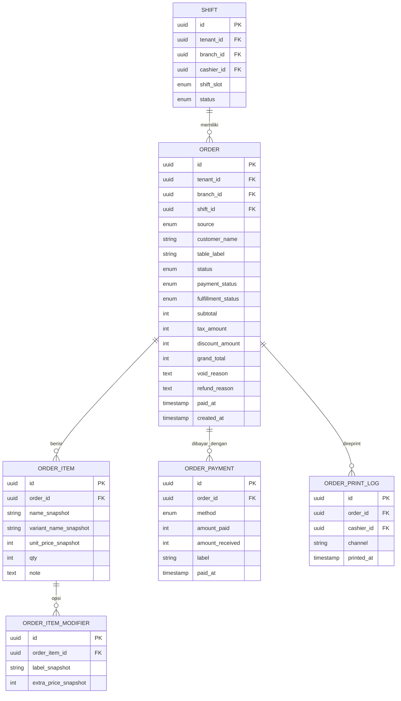

# Analisa Fitur Reprint Invoice dari Riwayat Order

## Konteks

User request: di riwayat order, kasir dapat print invoice sebelumnya ketika customer tiba-tiba meminta cetak ulang invoice.

[ASUMSI]
- Fokus utama adalah `satset-kasir` sebagai aplikasi operasional kasir.
- `satset-dashboard` dipakai admin tenant untuk audit/monitoring transaksi, bukan primary surface untuk cetak struk kasir.
- `satset-api` adalah source of truth order final.
- “Invoice” pada konteks ini berarti struk/receipt transaksi order, bukan billing invoice platform.
- Reprint yang valid harus memakai data transaksi final yang tersimpan, bukan state lokal transaksi terakhir.

## Temuan Arsitektur Saat Ini

### satset-kasir

- Halaman riwayat order sudah live dari API di [src/app/(tabs)/pengaturan.tsx](/Users/rofisudiyono/Documents/Project/satset-pos/satset-kasir/src/app/(tabs)/pengaturan.tsx).
- Query riwayat sudah tersedia via `useOrderHistoryQuery()` dan `GET /kasir/orders` di [src/hooks/api/use-kasir-api.ts](/Users/rofisudiyono/Documents/Project/satset-pos/satset-kasir/src/hooks/api/use-kasir-api.ts) dan [src/lib/api/kasir.api.ts](/Users/rofisudiyono/Documents/Project/satset-pos/satset-kasir/src/lib/api/kasir.api.ts).
- Flow print sudah ada, tetapi hanya di halaman sukses pembayaran [src/app/pembayaran-sukses/index.tsx](/Users/rofisudiyono/Documents/Project/satset-pos/satset-kasir/src/app/pembayaran-sukses/index.tsx).
- Receipt builder saat ini mengambil:
  - waktu cetak dari `getCurrentDateTime()` saat halaman dibuka, bukan `paidAt` order final
  - `storeInfo` hardcoded dari [src/features/payment/api/receipt.data.ts](/Users/rofisudiyono/Documents/Project/satset-pos/satset-kasir/src/features/payment/api/receipt.data.ts)
  - item modifier dari state POS lokal, bukan data modifier order final dari API

### satset-api

- Order final tersimpan di tabel `orders`, `order_items`, `order_item_modifiers`, `order_payments` di [src/db/schema/transactions.ts](/Users/rofisudiyono/Documents/Project/satset-pos/satset-api/src/db/schema/transactions.ts).
- Endpoint `GET /kasir/orders` sudah ada di [src/routes/kasir/orders.route.ts](/Users/rofisudiyono/Documents/Project/satset-pos/satset-api/src/routes/kasir/orders.route.ts), tetapi:
  - hanya mengambil order dari shift terakhir kasir login
  - limit 100
  - hanya `with: { items: true, payments: true }`, belum include `order_item_modifiers`
  - belum ada endpoint detail order khusus untuk reprint
- Data penting seperti `voidReason` dan `refundReason` ada di schema, tetapi belum diexpose dalam type kasir.

### satset-dashboard

- Dashboard transaksi tenant ada di [src/pages/admin-tenant/operasional/laporan-transaksi/page.tsx](/Users/rofisudiyono/Documents/Project/satset-pos/satset-dashboard/src/pages/admin-tenant/operasional/laporan-transaksi/page.tsx).
- Data tabel transaksi berasal dari `/admin/reports/transactions` via [src/features/reports/reports-api.ts](/Users/rofisudiyono/Documents/Project/satset-pos/satset-dashboard/src/features/reports/reports-api.ts).
- Payload dashboard hanya cukup untuk listing/reporting, belum cukup untuk render invoice detail karena tidak membawa:
  - line items lengkap beserta modifier
  - breakdown subtotal/diskon/pajak yang siap diprint
  - metadata receipt/store config
- Artinya dashboard saat ini bukan jalur implementasi utama untuk reprint receipt, kecuali ditambah endpoint detail khusus.

---

## A. User Stories

### Epic 1 — Reprint Invoice di Kasir `[P1-Must]`

Sebagai kasir, saya ingin membuka order dari riwayat lalu mencetak ulang invoice, agar saya bisa melayani customer yang meminta struk sebelumnya.

✅ AC1: Kasir dapat memilih order dari halaman riwayat order dan melihat aksi `Print Invoice`.
✅ AC2: Invoice yang dicetak menggunakan data transaksi final dari backend, bukan state transaksi terakhir.
✅ AC3: Waktu transaksi yang tampil di invoice memakai `paidAt` atau timestamp final order, bukan waktu print ulang.
✅ AC4: Item, qty, harga, subtotal, diskon, pajak, grand total, metode pembayaran tampil konsisten dengan transaksi asli.
✅ AC5: Reprint mendukung output PDF/share dan Bluetooth printer jika printer terhubung.
❌ Out of scope: edit isi invoice setelah transaksi selesai.

### Epic 2 — Pencarian Riwayat yang Bisa Direprint `[P1-Must]`

Sebagai kasir, saya ingin menemukan transaksi lama berdasarkan order id atau rentang waktu, agar saya bisa mencetak ulang invoice yang tidak selalu berasal dari shift aktif saat ini.

✅ AC1: Kasir dapat mencari order berdasarkan order id.
✅ AC2: Kasir dapat memfilter minimal berdasarkan tanggal transaksi.
✅ AC3: Order yang ditemukan tetap dibatasi pada tenant/cabang yang diizinkan.
✅ AC4: Sistem menampilkan empty state yang jelas bila order tidak ditemukan.
❌ Out of scope: pencarian lintas tenant.

### Epic 3 — Kontrak API Receipt Detail `[P1-Must]`

Sebagai aplikasi kasir, saya ingin mengambil detail order yang lengkap untuk kebutuhan reprint, agar format receipt akurat dan tidak bergantung pada logika lokal yang rapuh.

✅ AC1: API mengembalikan item order beserta modifier snapshot.
✅ AC2: API mengembalikan payment lines beserta nilai `amountPaid`, `amountReceived`, dan `paidAt`.
✅ AC3: API mengembalikan metadata status order/final payment yang relevan untuk menentukan apakah invoice boleh direprint.
✅ AC4: API mendukung pengambilan satu order by id.
❌ Out of scope: regenerate invoice number baru.

### Epic 4 — Audit/Admin Visibility di Dashboard `[P2-Should]`

Sebagai admin tenant, saya ingin melihat bahwa transaksi tertentu punya detail invoice yang konsisten dengan kasir, agar audit operasional tidak bergantung pada aplikasi kasir saja.

✅ AC1: Dashboard tetap bisa menampilkan daftar transaksi dengan identifier yang bisa dicocokkan ke reprint flow kasir.
✅ AC2: Jika nanti ditambah detail panel, data yang dipakai berasal dari endpoint detail yang sama/serupa dengan kasir.
❌ Out of scope: koneksi langsung ke printer dari dashboard pada fase awal.

### Epic 5 — Logging Reprint `[P3-Nice to have]`

Sebagai owner/admin, saya ingin sistem menyimpan jejak kapan invoice direprint, agar ada audit trail untuk transaksi sensitif.

✅ AC1: Sistem dapat menyimpan siapa yang melakukan reprint dan kapan.
✅ AC2: Audit log tidak mengubah nilai transaksi asli.
❌ Out of scope: approval berjenjang sebelum reprint.

---

## B. ERD

### Deskriptif

Entitas: Order
- id (PK, UUID)
- tenant_id (FK)
- branch_id (FK)
- shift_id (FK)
- source (enum: WALK_IN|WEB)
- table_id (FK, nullable)
- table_label (string, nullable)
- customer_id (FK, nullable)
- customer_name (string, nullable)
- tracking_token (UUID, nullable)
- status (enum: PAID|CANCELLED|REFUND)
- payment_status (enum: PENDING|PENDING_MANUAL_APPROVAL|PAID|FAILED|REFUNDED)
- fulfillment_status (enum: QUEUED|COOKING|READY|DELIVERED)
- subtotal (integer)
- tax_amount (integer)
- discount_amount (integer)
- promo_id (FK, nullable)
- grand_total (integer)
- stock_consumed (boolean)
- void_reason (text, nullable)
- refund_reason (text, nullable)
- ready_at (timestamp, nullable)
- served_at (timestamp, nullable)
- paid_at (timestamp, nullable)
- created_at (timestamp)
- updated_at (timestamp)

Entitas: OrderItem
- id (PK, UUID)
- order_id (FK)
- menu_id (FK, nullable)
- menu_variant_id (FK, nullable)
- name_snapshot (string)
- variant_name_snapshot (string, nullable)
- unit_price_snapshot (integer)
- qty (integer)
- note (text, nullable)
- status (enum: active|cancelled)
- cancelled_at (timestamp, nullable)

Entitas: OrderItemModifier
- id (PK, UUID)
- order_item_id (FK)
- modifier_option_id (FK, nullable)
- label_snapshot (string)
- extra_price_snapshot (integer)

Entitas: OrderPayment
- id (PK, UUID)
- order_id (FK)
- method (enum: CASH|QRIS|TRANSFER|DEBIT|CREDIT|EWALLET|VA)
- amount_paid (integer)
- amount_received (integer, nullable)
- label (string, nullable)
- paid_at (timestamp)

Entitas: Shift
- id (PK, UUID)
- tenant_id (FK)
- branch_id (FK)
- cashier_id (FK)
- cashier_name (string)
- shift_slot (enum: PAGI|SIANG|MALAM)
- status (enum: OPEN|CLOSED)

[USULAN P3] Entitas: OrderPrintLog
- id (PK, UUID)
- order_id (FK)
- tenant_id (FK)
- branch_id (FK)
- cashier_id (FK)
- channel (enum: PDF|BLUETOOTH)
- printed_at (timestamp)

Relasi:
- Shift 1:N Order
- Order 1:N OrderItem
- Order 1:N OrderPayment
- OrderItem 1:N OrderItemModifier
- Branch 1:N Order
- Customer 1:N Order

### Mermaid



---

## C. Reprint Invoice — Technical Spec

## 1. Overview

Fitur ini menambahkan kemampuan cetak ulang invoice/receipt dari riwayat order di `satset-kasir`. Implementasi harus menggunakan order final di backend sebagai source of truth agar hasil print ulang identik dengan transaksi asli. `satset-dashboard` disiapkan agar tetap konsisten dengan kontrak data transaksi, tetapi bukan jalur utama reprint pada fase awal.

## 2. Goals & Non-Goals

### Goals
- Kasir dapat reprint invoice dari riwayat order.
- Receipt memakai data order final yang persisted.
- Mendukung PDF/share dan Bluetooth print.
- Mendukung transaksi lama yang tidak hanya berasal dari flow `pembayaran-sukses`.
- Menjaga konsistensi data invoice antar kasir, dashboard, dan API.

### Non-Goals
- Mengubah nominal/order sesudah transaksi selesai.
- Menambahkan printer integration baru di dashboard pada fase awal.
- Menyelesaikan seluruh problem konfigurasi printer hardware.
- Menghasilkan nomor invoice baru saat reprint.

## 3. Aktor & Permission

| Aktor | Akses |
|-------|-------|
| Kasir | Lihat riwayat order cabang yang diizinkan, buka detail order, print ulang invoice |
| Admin Tenant | Lihat laporan transaksi dan mencocokkan transaksi; optional detail invoice di fase lanjut |
| Superadmin | Tidak terkait langsung dengan receipt order kasir |

[ASUMSI] Kasir boleh reprint order pada branch yang sama, tidak terbatas pada order yang dibuat oleh dirinya sendiri. Jika policy sebenarnya harus shift-scoped atau cashier-scoped, backend contract perlu dibatasi ulang.

## 4. Functional Requirements

FR-01: Sistem harus menyediakan daftar riwayat order yang bisa dicari dan dipilih untuk reprint.

FR-02: Sistem harus menyediakan detail order final by id yang memuat:
- header order
- line items
- modifier snapshots
- payment lines
- paid timestamp
- alasan cancel/refund bila ada

FR-03: `satset-kasir` harus menampilkan tombol `Print Invoice` di detail panel riwayat order.

FR-04: Tombol print harus tersedia untuk status order yang diizinkan.

[REKOMENDASI]
- P1: izinkan reprint untuk `PAID`
- P2: optional izinkan reprint untuk `CANCELLED`/`REFUND` dengan watermark/status label

FR-05: Print PDF/share dan Bluetooth harus memakai builder receipt yang sama.

FR-06: Receipt harus menggunakan `paidAt` sebagai waktu transaksi utama; fallback ke `createdAt` bila `paidAt` null.

FR-07: Riwayat order harus mendukung filter minimal:
- order id / search term
- tanggal
- status

FR-08: Backend harus membatasi akses berdasarkan tenant dan branch yang sah.

FR-09: Dashboard transaksi tenant harus tetap dapat menautkan transaksi yang sama via `order.id`, walau belum harus punya fitur print.

FR-10: [P3] Sistem dapat menyimpan audit log saat invoice direprint.

## 5. Non-Functional Requirements

- Performance:
  - list history paginated
  - detail order load < 500 ms pada data normal
  - print action tidak memblok UI list
- Security:
  - tenant isolation wajib
  - branch scoping wajib
  - tidak expose order tenant lain
- Reliability:
  - builder receipt tidak bergantung pada cart state lokal
  - jika printer Bluetooth gagal, PDF/share tetap tersedia
- Maintainability:
  - template receipt tunggal/shared utility
  - mapping order detail -> printable model terisolasi

## 6. API Endpoints

### Existing

| Method | Endpoint | Deskripsi | Auth |
|--------|----------|-----------|------|
| GET | `/api/kasir/orders` | Riwayat order kasir | ✅ |
| POST | `/api/kasir/orders/:id/pay` | Finalisasi pembayaran | ✅ |
| POST | `/api/kasir/orders/:id/deliver` | Tandai delivered | ✅ |
| GET | `/api/admin/reports/transactions` | Laporan transaksi tenant | ✅ |

### Proposed

| Method | Endpoint | Deskripsi | Auth |
|--------|----------|-----------|------|
| GET | `/api/kasir/orders` | Tambah filter `q`, `from`, `to`, `status`, `branchId`, `page`, `limit` | ✅ |
| GET | `/api/kasir/orders/:id` | Detail order lengkap untuk reprint | ✅ |
| POST | `/api/kasir/orders/:id/reprint-log` | [P3] Simpan audit log cetak ulang | ✅ |
| GET | `/api/admin/reports/transactions/:id` | [P2] Detail transaksi admin untuk audit invoice | ✅ |

### Proposed Response: GET `/api/kasir/orders/:id`

```json
{
  "data": {
    "id": "uuid",
    "tenantId": "uuid",
    "branchId": "uuid",
    "shiftId": "uuid",
    "source": "WALK_IN",
    "customerName": "Budi",
    "customerPhone": "0812xxxx",
    "tableLabel": "Meja 3",
    "status": "PAID",
    "paymentStatus": "PAID",
    "fulfillmentStatus": "DELIVERED",
    "subtotal": 80000,
    "discountAmount": 5000,
    "taxAmount": 8250,
    "grandTotal": 83250,
    "paidAt": "2026-04-13T10:22:00.000Z",
    "createdAt": "2026-04-13T10:10:00.000Z",
    "voidReason": null,
    "refundReason": null,
    "items": [
      {
        "id": "uuid",
        "nameSnapshot": "Kopi Susu",
        "variantNameSnapshot": "Large",
        "unitPriceSnapshot": 30000,
        "qty": 2,
        "note": "Less sugar",
        "modifiers": [
          {
            "id": "uuid",
            "labelSnapshot": "Extra Shot",
            "extraPriceSnapshot": 5000
          }
        ]
      }
    ],
    "payments": [
      {
        "id": "uuid",
        "method": "CASH",
        "amountPaid": 83250,
        "amountReceived": 100000,
        "label": null,
        "paidAt": "2026-04-13T10:22:00.000Z"
      }
    ]
  }
}
```

## 7. Tech Stack & Arsitektur

- Frontend kasir: Expo + React Native + Expo Router + TanStack Query
- Dashboard: React + Vite + TanStack Query
- Backend: Hono + TypeScript + Drizzle
- Database: PostgreSQL

### Arsitektur yang direkomendasikan

1. `satset-api` expose order detail lengkap dan history query yang tidak lagi hanya bergantung pada shift terakhir.
2. `satset-kasir` buat `PrintableReceiptOrder` mapper dari response API.
3. Extract receipt builder dari `pembayaran-sukses` menjadi util reusable:
   - `buildReceiptHtmlFromOrder(detail)`
   - `buildEscPosReceiptFromOrder(detail)`
4. `satset-kasir` gunakan util yang sama untuk:
   - sukses pembayaran
   - reprint dari riwayat
5. `satset-dashboard` tetap consume endpoint transaksi list; jika perlu detail invoice nanti, consume endpoint detail yang dedicated.

## 8. Dampak per Repo

### satset-kasir

- Tambah action `Print Invoice` pada detail panel riwayat order.
- Tambah query detail order bila list history tidak membawa semua field receipt.
- Refactor logic print di `pembayaran-sukses` menjadi reusable service/util.
- Tambah state loading/error saat print/reprint.
- [P2] Tambah search/filter riwayat agar transaksi lama mudah ditemukan.

### satset-api

- Ubah `GET /kasir/orders` supaya bukan hanya shift terakhir jika requirement memang “invoice sebelumnya” lintas shift.
- Tambah `GET /kasir/orders/:id`.
- Include `items.modifiers` pada detail.
- Pertimbangkan include `customerPhone`, `voidReason`, `refundReason`, `paymentStatus`.
- [P3] Tambah tabel/log endpoint reprint audit.

### satset-dashboard

- Fase awal: tidak blocking.
- [P2] Tambah deep-link/detail action untuk audit invoice bila dibutuhkan.
- [P2] Jika ingin preview invoice di dashboard, gunakan endpoint detail khusus, jangan rakit dari payload report list saat ini.

## 9. Risiko & Mitigasi

| Risiko | Dampak | Mitigasi |
|--------|--------|----------|
| Endpoint history tetap shift-scoped | Kasir tidak bisa cari invoice lama | Ubah ke branch/date scoped atau tambah endpoint detail by id |
| Modifier order tidak ikut response | Invoice reprint tidak sama dengan invoice asli | Include `order_item_modifiers` di endpoint detail |
| Receipt masih pakai `storeInfo` hardcoded | Header struk salah antar tenant/cabang | Ambil store config dari backend/settings atau auth context |
| Receipt pakai waktu sekarang | Invoice reprint tidak akurat | Gunakan `paidAt`/`createdAt` order final |
| Logic print terduplikasi | Bug beda output PDF vs Bluetooth | Satu printable mapper + satu template source |
| Dashboard memakai report list untuk print | Data invoice tidak lengkap | Pisahkan endpoint reporting vs endpoint detail receipt |

## 10. Open Questions

- [ ] Apakah kasir boleh reprint hanya transaksi yang dia buat, atau semua transaksi di cabang?
- [ ] Apakah transaksi dari shift kemarin/minggu lalu harus tetap bisa dicari dari kasir?
- [ ] Apakah order `CANCELLED`/`REFUND` tetap boleh dicetak ulang dengan label status?
- [ ] Sumber data header receipt seharusnya dari mana: branch settings, tenant settings, atau masih hardcoded sementara?
- [ ] Perlu audit log reprint sejak phase 1 atau cukup phase 2?

---

## D. Coding Prompts

--- PROMPT: Reprint Invoice API Contract ([BACKEND]) ---
Stack: Node.js + Hono + TypeScript + Drizzle
Context: `satset-api` sudah menyimpan order final di tabel `orders`, `order_items`, `order_item_modifiers`, dan `order_payments`. `satset-kasir` perlu reprint invoice dari riwayat order dengan data transaksi final yang lengkap.

Task:
Implement endpoint detail order untuk kasir dan perluas endpoint riwayat order agar bisa dipakai mencari transaksi lama untuk reprint invoice.

Requirements:
- Tambahkan `GET /api/kasir/orders/:id`
- Validasi tenant isolation wajib
- Batasi akses berdasarkan branch yang valid
- Response harus include:
  - order header
  - `items` beserta `modifiers`
  - `payments`
  - `paymentStatus`, `fulfillmentStatus`, `voidReason`, `refundReason`, `paidAt`, `createdAt`
- Perluas `GET /api/kasir/orders` agar mendukung filter `q`, `from`, `to`, `status`, `page`, `limit`
- Jangan batasi hanya shift terakhir jika requirement reprint lintas shift
- Pertahankan backward compatibility semaksimal mungkin

Expected output:
- Route handler baru/updated
- Validator query/path
- Type response yang konsisten
- Catatan migration bila perlu

Notes:
- Gunakan TypeScript
- Ikuti pola route existing di repo
- Jangan gabungkan concern reporting admin ke endpoint kasir
--- END PROMPT ---

--- PROMPT: Receipt Detail Mapping ([FRONTEND]) ---
Stack: Expo Router + React Native + TypeScript + TanStack Query
Context: `satset-kasir` sudah punya halaman `pembayaran-sukses` yang bisa print receipt, dan halaman `Riwayat Order` yang menampilkan transaksi dari API.

Task:
Refactor flow print receipt agar bisa dipakai ulang oleh halaman pembayaran sukses dan riwayat order.

Requirements:
- Extract mapper `KasirOrderDetail -> PrintableReceiptOrder`
- Extract helper:
  - `buildReceiptHtmlFromOrder`
  - `buildEscPosReceiptFromOrder`
- Gunakan `paidAt` sebagai tanggal transaksi utama
- Render modifier item pada invoice
- Jangan gunakan `getCurrentDateTime()` untuk reprint
- Jangan gunakan state cart/pos lokal sebagai source of truth untuk reprint
- Tambahkan tombol `Print Invoice` di detail panel riwayat order
- Tampilkan loading/error state saat print

Expected output:
- Utility reusable untuk receipt
- UI action di halaman riwayat
- Integrasi PDF/share + Bluetooth menggunakan util yang sama

Notes:
- Gunakan TypeScript
- Pertahankan UX existing semaksimal mungkin
- Hindari duplikasi antara halaman `pembayaran-sukses` dan `riwayat order`
--- END PROMPT ---

--- PROMPT: Kasir Order Types & Query Hooks ([FRONTEND]) ---
Stack: Expo + TypeScript + TanStack Query
Context: Type `KasirOrder` saat ini belum cukup kaya untuk kebutuhan reprint receipt detail.

Task:
Update layer API client dan query hooks di `satset-kasir` untuk mendukung order detail dan pencarian riwayat.

Requirements:
- Tambah type `KasirOrderDetail`
- Tambah type modifier item
- Tambah method API `getOrderHistory(params)` dengan filter optional
- Tambah method API `getOrderDetail(orderId)`
- Tambah query hook detail order
- Pastikan invalidation query tetap aman setelah cancel/refund/deliver

Expected output:
- Type baru
- API client update
- Query hook baru

Notes:
- Gunakan naming convention existing
- Pertahankan kompatibilitas `useOrderHistoryQuery`
--- END PROMPT ---

--- PROMPT: Dashboard Transaction Detail Alignment ([FRONTEND]) ---
Stack: React + Vite + TypeScript + TanStack Query
Context: `satset-dashboard` saat ini punya laporan transaksi berbasis endpoint reporting list, tetapi data itu belum cukup untuk preview invoice detail.

Task:
Analisa dan siapkan integrasi dashboard agar transaksi dapat di-audit terhadap data invoice tanpa mencoba membangun receipt dari payload report list.

Requirements:
- Jangan print dari payload `/admin/reports/transactions`
- Jika dibutuhkan, tambahkan action `Lihat Detail`
- Consume endpoint detail transaksi/order khusus
- Tampilkan item list, payment summary, dan metadata transaksi secara read-only
- Pastikan identifier transaksi konsisten dengan kasir (`order.id`)

Expected output:
- API integration plan atau implementation untuk detail panel/modal
- Tidak perlu printer integration pada fase awal

Notes:
- Gunakan TypeScript
- Preserve style dashboard existing
--- END PROMPT ---

--- PROMPT: Reprint Audit Log ([DATABASE]) ---
Stack: PostgreSQL + Drizzle
Context: Ada kebutuhan opsional untuk melacak siapa dan kapan invoice direprint.

Task:
Tambahkan audit log untuk event reprint invoice order.

Requirements:
- Buat tabel `order_print_logs`
- Simpan `orderId`, `tenantId`, `branchId`, `cashierId`, `channel`, `printedAt`
- Tambahkan relation seperlunya
- Siapkan insert flow yang bisa dipanggil backend setelah print request/log event

Expected output:
- Schema
- Migration
- Minimal service/helper untuk insert log

Notes:
- Jangan ubah tabel transaksi utama
- Audit log bersifat append-only
--- END PROMPT ---

--- PROMPT: Receipt Regression Coverage ([TESTING]) ---
Stack: TypeScript test stack sesuai repo
Context: Receipt reprint harus identik dengan transaksi final dan tidak boleh bergantung pada state lokal.

Task:
Tambahkan test coverage untuk mapper receipt dan endpoint detail order.

Requirements:
- Test response detail order include modifier dan payment lines
- Test mapper receipt memakai `paidAt` saat ada
- Test fallback ke `createdAt` bila `paidAt` null
- Test cancelled/refund order behavior sesuai policy
- Test history filter query untuk search/date/status

Expected output:
- Unit/integration tests untuk backend dan frontend utility

Notes:
- Fokus ke kasus yang berisiko bikin invoice berbeda dari transaksi asli
--- END PROMPT ---

---

## 🗺️ Recommended Implementation Order

### Sprint 1 (Foundation)
1. Tambah endpoint detail order kasir by id di `satset-api`
2. Lengkapi payload dengan item modifiers + payment detail
3. Refactor receipt builder di `satset-kasir` menjadi util reusable
4. Tambah tombol reprint di detail panel riwayat order

### Sprint 2 (Core Features)
1. Perluas `GET /kasir/orders` untuk search/filter tanggal/status
2. Ubah history scope agar mendukung invoice lama lintas shift sesuai policy
3. Rapikan source data header receipt agar tidak hardcoded

### Sprint 3 (Polish)
1. Tambah admin detail audit di `satset-dashboard`
2. Tambah audit log reprint
3. Tambah test coverage regresi receipt

## ⚠️ Pertanyaan untuk Klien / Klarifikasi

1. Invoice lama yang boleh direprint itu hanya shift aktif, shift kasir yang sama, atau semua transaksi cabang?
2. Apakah order `REFUND` dan `CANCELLED` perlu tetap bisa dicetak ulang?
3. Apakah receipt header harus mengambil data toko/cabang dinamis dari backend sekarang juga?

## 💡 Saran Teknis

- MVP paling aman adalah implementasi di `satset-api` + `satset-kasir`; `satset-dashboard` tidak perlu dijadikan blocker.
- Pisahkan endpoint reporting dan endpoint receipt detail. Reporting payload memang ringan, receipt payload harus lengkap.
- Jangan reuse state POS lokal untuk reprint. Semua receipt historis harus dibangun dari order final persisted.
- Jika requirement benar-benar “invoice sebelumnya” dalam arti transaksi lama, ubah scope history dari `last shift` menjadi `branch scoped + filterable`, karena kontrak sekarang belum cukup.

## Asumsi yang Digunakan

- `invoice` = receipt/struk order kasir, bukan platform billing invoice.
- Kasir setidaknya boleh melihat order di cabang yang sama.
- Reprint paling penting untuk transaksi `PAID`.
- Dashboard pada fase awal hanya perlu alignment data, bukan direct printing.

Ada bagian yang ingin diubah, diperdalam, atau ditambahkan?
