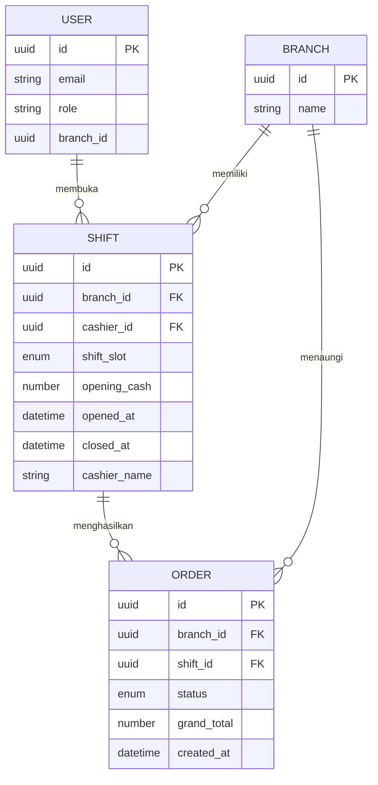

# Analisa Hilangnya Step Open Shift / Tutup Shift di `satset-kasir`

## Ringkasan Temuan

Fitur **open shift** dan **close shift** di `satset-kasir` **tidak benar-benar hilang dari codebase**, tetapi **hilang dari flow UI utama** sehingga secara produk terlihat seperti tidak ada.

Temuan utama:

1. **API dan screen sudah tersedia**
   - API:
     - `GET /kasir/shifts/active` di [`src/lib/api/kasir.api.ts`](/Users/rofisudiyono/Documents/Project/satset-kasir/src/lib/api/kasir.api.ts:20)
     - `POST /kasir/shifts/open` di [`src/lib/api/kasir.api.ts`](/Users/rofisudiyono/Documents/Project/satset-kasir/src/lib/api/kasir.api.ts:31)
     - `POST /kasir/shifts/close` di [`src/lib/api/kasir.api.ts`](/Users/rofisudiyono/Documents/Project/satset-kasir/src/lib/api/kasir.api.ts:53)
   - Screen:
     - buka shift mobile di [`src/app/mobile/buka-shift.tsx`](/Users/rofisudiyono/Documents/Project/satset-kasir/src/app/mobile/buka-shift.tsx:1)
     - buka shift tablet di [`src/app/tablet/buka-shift.tsx`](/Users/rofisudiyono/Documents/Project/satset-kasir/src/app/tablet/buka-shift.tsx:1)
     - tutup shift di [`src/app/tutup-shift/index.tsx`](/Users/rofisudiyono/Documents/Project/satset-kasir/src/app/tutup-shift/index.tsx:1)

2. **Flow login tidak mengarahkan kasir ke open shift**
   - Setelah login, app langsung redirect ke home/device home:
     - [`src/features/auth/screens/LoginScreen.tsx`](/Users/rofisudiyono/Documents/Project/satset-kasir/src/features/auth/screens/LoginScreen.tsx:61)
     - `router.replace(getHomeRoute(isTablet))`
   - Secara requirement di README, flow resminya adalah:
     - login → buka shift → operasional
     - lihat [`README.md`](/Users/rofisudiyono/Documents/Project/satset-kasir/README.md:6)

3. **Open shift hanya muncul sebagai redirect defensif di screen tertentu**
   - Beberapa screen transaksi memang me-redirect ke `/buka-shift` kalau shift belum aktif:
     - [`src/features/transactions/screens/transaction-entry/shared/useTransactionEntry.ts`](/Users/rofisudiyono/Documents/Project/satset-kasir/src/features/transactions/screens/transaction-entry/shared/useTransactionEntry.ts:112)
     - [`src/app/keranjang/index.tsx`](/Users/rofisudiyono/Documents/Project/satset-kasir/src/app/keranjang/index.tsx:141)
     - [`src/app/pilih-pembayaran/index.tsx`](/Users/rofisudiyono/Documents/Project/satset-kasir/src/app/pilih-pembayaran/index.tsx:70)
     - [`src/app/pembayaran-tunai/index.tsx`](/Users/rofisudiyono/Documents/Project/satset-kasir/src/app/pembayaran-tunai/index.tsx:62)
   - Artinya open shift sekarang diperlakukan sebagai **guard**, bukan **step operasional utama**.

4. **Surface navigasi shift tidak konsisten antar device**
   - Tablet/desktop-like shell masih punya CTA shift:
     - `SideNav` punya tombol `Buka Shift / Tutup Shift`
     - [`src/components/layout/SideNav.tsx`](/Users/rofisudiyono/Documents/Project/satset-kasir/src/components/layout/SideNav.tsx:134)
   - Mobile tabs **tidak punya menu buka shift**
     - tab hanya: `pesanan-web`, `input-manual`, `riwayat`, `setting`
     - [`src/app/mobile/(tabs)/_layout.tsx`](/Users/rofisudiyono/Documents/Project/satset-kasir/src/app/mobile/(tabs)/_layout.tsx:45)
   - Mobile setting hanya expose **Tutup Shift**, bukan **Buka Shift**
     - [`src/app/mobile/(tabs)/setting.tsx`](/Users/rofisudiyono/Documents/Project/satset-kasir/src/app/mobile/(tabs)/setting.tsx:79)

5. **Ada komponen shift-oriented yang tidak lagi dipakai**
   - `ShiftCard`, `WarningBanner`, `QuickActions` tersedia tapi tidak terpasang ke halaman aktif mana pun:
     - [`src/features/shift/components/ShiftCard/ShiftCard.tsx`](/Users/rofisudiyono/Documents/Project/satset-kasir/src/features/shift/components/ShiftCard/ShiftCard.tsx:23)
     - [`src/features/home/components/WarningBanner/WarningBanner.tsx`](/Users/rofisudiyono/Documents/Project/satset-kasir/src/features/home/components/WarningBanner/WarningBanner.tsx:11)
     - [`src/features/home/components/QuickActions/QuickActions.tsx`](/Users/rofisudiyono/Documents/Project/satset-kasir/src/features/home/components/QuickActions/QuickActions.tsx:9)
   - Ini mengindikasikan ada **flow home/ops dashboard** yang sebelumnya dirancang untuk mengangkat status shift, tetapi sekarang orphaned / tidak lagi dirender.

## Kesimpulan Akar Masalah

`satset-api` dan `satset-dashboard` sudah mengintegrasikan shift sebagai modul yang eksplisit, tetapi di `satset-kasir` integrasi UI-nya **belum dijadikan first-class flow**.

Masalah utamanya bukan backend contract, melainkan:

- **post-login routing salah prioritas**: login langsung ke home, bukan validasi `active shift`
- **entry point mobile tidak lengkap**: hanya ada `tutup shift`, tidak ada CTA `buka shift`
- **flow shift tersembunyi sebagai implicit redirect**, bukan menu/step yang terlihat
- **ada sisa komponen shift dashboard yang tidak lagi di-wire**

---

## A. USER STORIES

### Epic 1 — Shift Visibility & Entry Point

**[P1-Must]** Sebagai kasir, saya ingin setelah login langsung diarahkan ke proses buka shift jika belum ada shift aktif, agar operasional kasir selalu dimulai dari flow yang benar.

✅ AC1: Jika `GET /kasir/shifts/active` mengembalikan `null`, app redirect ke `buka-shift` setelah login  
✅ AC2: Jika ada shift aktif, app masuk ke home/tab utama tanpa interupsi  
✅ AC3: Perilaku konsisten di mobile dan tablet  
❌ Out of scope: perubahan payload API shift

**[P1-Must]** Sebagai kasir, saya ingin melihat status shift dari halaman utama, agar saya tahu apakah outlet sedang siap menerima transaksi.

✅ AC1: Ada indikator `Shift Aktif` / `Belum Buka Shift` di home atau header utama  
✅ AC2: Ada CTA yang jelas untuk `Buka Shift` saat belum aktif  
✅ AC3: Ada CTA yang jelas untuk `Tutup Shift` saat shift aktif  
❌ Out of scope: dashboard analitik shift lengkap

### Epic 2 — Navigation Consistency

**[P1-Must]** Sebagai kasir mobile, saya ingin menu shift tersedia di navigasi yang mudah ditemukan, agar saya tidak perlu memicu redirect tidak langsung dari screen transaksi.

✅ AC1: Mobile surface memiliki akses eksplisit ke `Buka Shift` atau state card shift  
✅ AC2: Menu `Tutup Shift` hanya tampil saat shift aktif, atau disabled dengan penjelasan  
✅ AC3: Tidak ada kondisi di mana kasir kebingungan mencari entry point shift  
❌ Out of scope: redesign total tab navigation

**[P2-Should]** Sebagai supervisor/QA, saya ingin flow shift di `satset-kasir` konsisten dengan `satset-dashboard`, agar perilaku operasional antar aplikasi seragam.

✅ AC1: Terminologi open/close shift sama  
✅ AC2: Trigger visibility shift mengikuti state backend aktif/nonaktif  
✅ AC3: Jalur happy path dan edge case terdokumentasi  
❌ Out of scope: sinkronisasi semua komponen visual antar repo

### Epic 3 — Error Prevention

**[P2-Should]** Sebagai kasir, saya ingin screen yang butuh shift aktif memberi CTA langsung ke buka shift, agar saya tidak berhenti di halaman kosong atau data tidak muncul tanpa konteks.

✅ AC1: Screen yang butuh shift menampilkan empty state dengan CTA ke `Buka Shift`  
✅ AC2: Query yang disabled karena `isShiftStarted === false` punya penjelasan UI  
✅ AC3: Tidak hanya mengandalkan silent disable/refetch noop  
❌ Out of scope: state machine penuh untuk semua screen

---

## B. ERD

### Deskriptif

Entitas: `User`
- `id` (PK, UUID)
- `role` (string/enum)
- `branchId` (UUID, FK-like to Branch)
- `email` (string)

Entitas: `Branch`
- `id` (PK, UUID)
- `name` (string)

Entitas: `Shift`
- `id` (PK, UUID)
- `branchId` (UUID)
- `cashierId` (UUID)
- `shiftSlot` (enum: `PAGI|SIANG|MALAM`)
- `openingCash` (number)
- `openedAt` (datetime)
- `closedAt` (datetime, nullable)
- `cashierName` (string)

Entitas: `Order`
- `id` (PK, UUID)
- `branchId` (UUID)
- `shiftId` (UUID, nullable in legacy/local state)
- `status` (enum)
- `grandTotal` (number)
- `createdAt` (datetime)

Relasi:
- `Branch 1:N Shift`
- `User 1:N Shift`
- `Shift 1:N Order`
- `Branch 1:N Order`

### Mermaid

---

## C. TECHNICAL SPEC / PRD

# Shift Entry Point Consistency — Technical Spec

## 1. Overview

Fitur shift di `satset-kasir` sudah terhubung ke backend, tetapi belum diekspos secara konsisten di UI. Spec ini merapikan flow agar post-login, navigation, dan operational guards mengikuti requirement resmi: **login → buka shift → transaksi → tutup shift**.

## 2. Goals & Non-Goals

### Goals
- Menjadikan `open shift` sebagai langkah eksplisit setelah login saat belum ada shift aktif
- Menampilkan status shift secara konsisten di mobile dan tablet
- Menyediakan akses `tutup shift` yang jelas dan hanya relevan saat shift aktif
- Menghilangkan UX tersembunyi yang hanya bergantung pada redirect dari screen transaksi

### Non-Goals
- Mengubah contract API shift
- Mendesain ulang seluruh IA/tab app
- Menyatukan semua komponen UI dengan `satset-dashboard`

## 3. Aktor & Permission

| Aktor | Akses |
|-------|-------|
| Kasir | Buka shift, lihat shift aktif, tutup shift |
| Admin outlet | Sama seperti kasir jika role diizinkan login |
| User non-kasir | Tidak boleh mengakses app kasir |

## 4. Functional Requirements

FR-01: Setelah login sukses, app harus mengecek active shift sebelum menentukan landing screen.  
FR-02: Jika tidak ada shift aktif, landing diarahkan ke `buka-shift`.  
FR-03: Jika shift aktif ada, landing diarahkan ke home route sesuai device.  
FR-04: Mobile harus punya entry point eksplisit untuk `buka shift` saat shift belum aktif.  
FR-05: `Tutup Shift` hanya tampil sebagai primary action saat shift aktif.  
FR-06: Screen yang memerlukan shift aktif harus menampilkan CTA/penjelasan, bukan hanya silently empty/disabled.  
FR-07: Komponen orphaned (`ShiftCard`/home status block) harus dipakai ulang atau dihapus agar tidak membingungkan maintenance.

## 5. Non-Functional Requirements

- Performance: pengecekan active shift tidak boleh menambah loading flow login secara berlebihan
- Consistency: flow harus identik antar mobile dan tablet
- Maintainability: route decisions dipusatkan, jangan tersebar di banyak screen guard
- UX clarity: status shift terlihat dalam < 1 tap dari landing page

## 6. API Endpoints

| Method | Endpoint | Deskripsi | Auth |
|--------|----------|-----------|------|
| GET | `/kasir/shifts/active` | Ambil shift aktif user/cabang | ✅ |
| POST | `/kasir/shifts/open` | Buka shift baru | ✅ |
| POST | `/kasir/shifts/close` | Tutup shift aktif | ✅ |

## 7. Tech Stack & Arsitektur

- Frontend: Expo Router + React Native + TypeScript
- State: Jotai + MMKV
- Data fetching: TanStack Query via custom hooks
- Auth bootstrap: `useAuth()` + `KasirShiftSync`
- Routing concern:
  - current issue: login memilih `getHomeRoute(...)` terlalu dini
  - recommended: buat `postLoginRouteResolver` berbasis `active shift`

## 8. Risiko & Mitigasi

| Risiko | Dampak | Mitigasi |
|--------|--------|----------|
| Redirect loop antara login/home/buka-shift | User tidak bisa masuk | Pusatkan route resolver + guard test |
| State MMKV stale saat relogin | Shift lama terlihat aktif | Pastikan clear state saat logout dan sinkronisasi query sesudah login |
| Mobile tab tidak punya ruang menu baru | UX tetap ambigu | Gunakan shift card pada halaman setting/home tanpa ubah tab count |
| `Tutup Shift` tampil saat belum aktif | Error API / UX membingungkan | Gate visibility by `isShiftStarted` |

## 9. Open Questions

- [ ] Apakah landing ideal setelah login memang harus selalu `buka-shift` jika tidak ada shift aktif?
- [ ] Di mobile, shift action lebih cocok ditempatkan di `setting`, `home header`, atau screen khusus dashboard?
- [ ] Apakah `tutup shift` perlu disembunyikan total saat belum aktif, atau tetap tampil disabled dengan helper text?

---

## D. CODING PROMPTS

--- PROMPT: shift route resolver ([FRONTEND]) ---
Stack: Expo Router + React Native + TypeScript
Context: App kasir sudah punya API active/open/close shift, tetapi login masih langsung redirect ke home.

Task:
Buat refactor flow post-login agar app menentukan landing route berdasarkan status active shift. Jika belum ada shift aktif, arahkan ke route buka-shift sesuai device namespace. Jika ada shift aktif, arahkan ke home route seperti sekarang.

Requirements:
- Jangan ubah contract API
- Reuse `useActiveShiftQuery` atau layer auth bootstrap yang sudah ada
- Hindari race condition antara auth state dan shift sync
- Konsisten untuk mobile dan tablet

Expected output:
- route resolver terpusat untuk post-login
- login flow yang tidak lagi hardcode `getHomeRoute`
- fallback aman saat query active shift masih loading/error

Notes:
- Gunakan TypeScript
- Ikuti konvensi Expo Router project ini
- Jangan duplikasi logic namespace route
--- END PROMPT ---

--- PROMPT: mobile shift entry point ([MOBILE]) ---
Stack: Expo Router + React Native + TypeScript
Context: Mobile tabs hanya expose `Tutup Shift` di setting dan tidak punya CTA eksplisit untuk `Buka Shift`.

Task:
Tambahkan entry point shift yang jelas di surface mobile tanpa mengubah struktur tab secara besar. Solusi yang disarankan: tampilkan section shift status di halaman `setting` atau landing mobile, dengan CTA `Buka Shift` saat belum aktif dan `Tutup Shift` saat aktif.

Requirements:
- Visibility action harus bergantung pada `isShiftStartedAtom`
- Saat shift belum aktif, jangan tampilkan CTA `Tutup Shift`
- Saat shift aktif, tampilkan ringkasan singkat shift aktif
- Reuse style system dan komponen yang ada jika memungkinkan

Expected output:
- mobile screen dengan status shift yang jelas
- CTA eksplisit ke `/mobile/buka-shift` atau `/tutup-shift`
- UX yang konsisten dengan tablet/sidebar version

Notes:
- Pertimbangkan reuse `ShiftCard`
- Hindari dead component baru
--- END PROMPT ---

--- PROMPT: shift-aware empty states ([FRONTEND]) ---
Stack: Expo Router + React Native + TypeScript
Context: Beberapa query dan screen bergantung pada `isShiftStarted`, tapi saat false user hanya melihat flow yang tidak informatif atau redirect tersembunyi.

Task:
Audit screen yang membutuhkan shift aktif, lalu ubah agar user mendapat empty state atau CTA yang eksplisit ke buka-shift. Kurangi silent redirect yang membuat flow shift terasa "hilang".

Requirements:
- Fokus pada screen operasional utama
- Tetap jaga happy path cepat saat shift aktif
- Copy harus singkat dan operasional

Expected output:
- daftar screen yang diperbarui
- state UI yang jelas untuk kondisi belum buka shift
- lebih sedikit kebingungan pada first login

Notes:
- Redirect keras tetap boleh untuk screen kritikal, tapi beri konteks jika memungkinkan
--- END PROMPT ---

--- PROMPT: shift navigation cleanup ([FRONTEND]) ---
Stack: Expo Router + React Native + TypeScript
Context: Ada komponen `ShiftCard`, `WarningBanner`, dan `QuickActions` yang tidak lagi dipakai sehingga flow home shift terkesan setengah jadi.

Task:
Lakukan cleanup arsitektur UI shift: tentukan komponen mana yang akan dipakai ulang untuk landing/home, dan mana yang sebaiknya dihapus agar codebase tidak misleading.

Requirements:
- Jangan hapus komponen yang masih relevan tanpa penggantian
- Prioritaskan reuse jika desain masih cocok
- Pastikan entry point shift terlihat di UI aktif

Expected output:
- home/setting surface yang final untuk shift
- komponen orphaned berkurang
- dependency UI shift lebih mudah dirawat

Notes:
- Sertakan update import/exports yang diperlukan
--- END PROMPT ---

--- PROMPT: shift flow regression tests ([TESTING]) ---
Stack: TypeScript test stack sesuai project
Context: Perubahan routing dan navigasi shift rawan regressions.

Task:
Tambahkan test coverage untuk flow berikut: login tanpa active shift, login dengan active shift, visibility CTA shift di mobile, dan visibility tombol tutup shift saat shift aktif.

Requirements:
- Cover route resolution logic
- Cover conditional rendering berbasis `isShiftStarted`
- Jangan bergantung pada API live

Expected output:
- unit/integration tests untuk shift flow utama
- guard terhadap regression "menu shift hilang"

Notes:
- Mock auth state dan active shift response
--- END PROMPT ---

---

## 🗺️ Recommended Implementation Order

### Sprint 1 (Foundation)
1. Refactor post-login route resolver berbasis active shift
2. Samakan keputusan route mobile vs tablet
3. Audit screen yang masih mengandalkan hidden redirect

### Sprint 2 (Core Features)
1. Tambahkan shift status card/section pada mobile surface utama
2. Tampilkan CTA `Buka Shift` / `Tutup Shift` yang eksplisit
3. Rapikan visibility `Tutup Shift` di settings

### Sprint 3 (Polish)
1. Reuse atau hapus komponen shift/home yang orphaned
2. Tambahkan regression tests untuk flow shift
3. Sinkronkan copywriting/label dengan `satset-dashboard`

## ⚠️ Pertanyaan untuk Klien / Klarifikasi

1. Landing resmi setelah login di kasir harus selalu `open shift` jika belum aktif, atau tetap boleh masuk home dengan banner CTA?
2. Di mobile, shift action lebih baik diletakkan di `setting` atau di halaman pertama setelah login?
3. Apakah `tutup shift` harus sepenuhnya disembunyikan saat shift belum aktif?

## 💡 Saran Teknis

- Jangan mengandalkan `screen-level redirect` sebagai mekanisme utama operasional shift.
- Jadikan `active shift` sebagai bagian dari bootstrap routing, bukan sekadar state lokal.
- Reuse komponen shift yang sudah ada supaya gap bisa ditutup cepat tanpa redesign besar.
- Jika ingin parity dengan `satset-dashboard`, mulai dari **behavior parity** dulu, bukan visual parity.

## [ASUMSI]

- [ASUMSI] `satset-api` sudah benar mengembalikan active shift dan mendukung open/close shift untuk role kasir.
- [ASUMSI] Keluhan user merujuk ke **UI/flow kasir**, bukan error backend.
- [ASUMSI] Device yang paling terasa kehilangan menu adalah **mobile**, karena tablet/sidebar masih punya CTA shift.

Ada bagian yang ingin diubah, diperdalam, atau ditambahkan?
